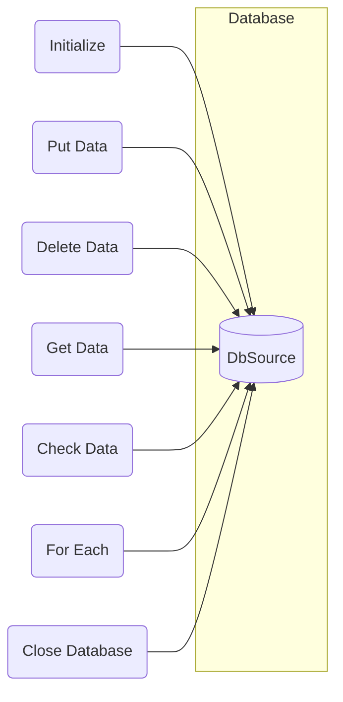

## Module: CheckPointV2Store.java
根据提供的代码模块，以下是以中文进行的综合分析：

- **模块名称**：CheckPointV2Store.java

- **主要目标**：该模块的目的是提供对Tron区块链中检查点数据的存储和管理功能。它允许用户存储、删除、获取和检查检查点数据的存在。

- **关键功能**：
  - `put(byte[] key, byte[] item)`：存储键值对数据。
  - `delete(byte[] key)`：根据键删除数据。
  - `get(byte[] key)`：根据键获取数据，可能抛出`InvalidProtocolBufferException`、`ItemNotFoundException`或`BadItemException`异常。
  - `has(byte[] key)`：检查某个键的数据是否存在。
  - `forEach(Consumer action)`：对每个元素执行操作。
  - `spliterator()`：提供拆分迭代器。
  - `close()`：关闭数据库连接。

- **关键变量**：未直接列出，但根据方法可以推断`dbSource`（数据库源）是一个关键变量，用于实际的数据操作。

- **相互依赖性**：该模块依赖于`TronDatabase<byte[]>`类和数据库源（`dbSource`），以及可能与其他管理区块链数据的模块有交互。

- **核心与辅助操作**：核心操作包括数据的增删查改（`put`、`delete`、`get`、`has`），辅助操作可能包括`forEach`和`spliterator`方法，用于数据的遍历和分割处理。

- **操作顺序**：通常，初始化数据库后（`init`方法），可以执行增删查改等操作，最后在不需要时关闭数据库（`close`方法）。

- **性能方面**：性能考虑可能包括数据操作的效率和数据库连接的管理。代码示例中未详细说明具体实现，但这些操作的性能对于整体系统性能是重要的。

- **可重用性**：该模块设计为可重用的组件，可以在需要管理检查点数据的不同场景下使用。

- **使用**：主要用于Tron区块链系统中管理检查点数据，如保存区块链的特定状态，以便于恢复和验证。

- **假设**：假设数据库源（`dbSource`）已经正确配置且可用，且用户熟悉基本的数据库操作。

请注意，由于代码示例中未提供具体实现细节，以上分析基于代码结构和方法签名进行。
## Flow Diagram [via mermaid]

