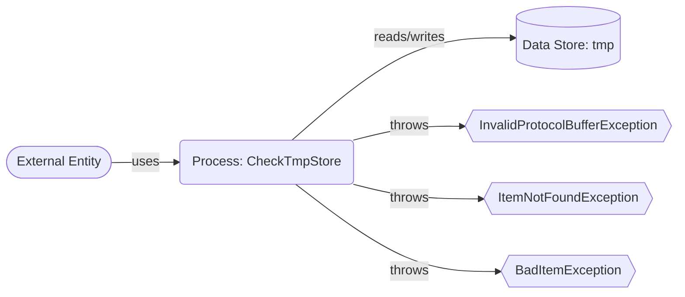

## Module: CheckTmpStore.java
根据提供的代码模块，以下是用中文进行的综合分析：

- **模块名称**：CheckTmpStore.java

- **主要目标**：这个模块的目的是提供一个临时存储的解决方案，用于管理和操作临时数据。它继承自`TronDatabase`，专门处理字节数据。

- **关键功能**：
  - `put(byte[] key, byte[] item)`：将给定的键值对存储到临时存储中。
  - `delete(byte[] key)`：从临时存储中删除指定的键及其对应的值。
  - `get(byte[] key)`：根据给定的键从临时存储中检索值。
  - `has(byte[] key)`：检查临时存储中是否存在给定的键。
  - `forEach(Consumer action)`：对临时存储中的每个元素执行给定的操作。
  - `spliterator()`：提供一个拆分器，用于并行处理临时存储中的元素。

- **关键变量**：没有直接显示的关键变量，但`ApplicationContext ctx`作为依赖注入，是一个重要的组件，用于访问应用程序上下文。

- **相互依赖性**：这个类依赖于Spring框架的`ApplicationContext`来进行初始化，并且作为`TronDatabase`的子类，它可能与系统中其他用于数据持久化和检索的组件有交互。

- **核心与辅助操作**：核心操作包括数据的增删查改（`put`, `delete`, `get`, `has`），而辅助操作包括遍历和拆分（`forEach`, `spliterator`）。

- **操作序列**：虽然代码中没有明确的流程描述，但一般的使用序列可能是先检查一个键是否存在（`has`），然后可以进行添加（`put`）、检索（`get`）或删除（`delete`）操作。

- **性能方面**：由于方法体为空，无法直接评估性能。但在设计时，需要考虑到数据存储和检索的效率，特别是在并发访问和大数据量处理时。

- **可重用性**：这个类通过提供基本的数据操作接口，具有一定的可重用性，可以根据需要存储不同类型的临时数据。

- **用途**：可以用作在处理过程中需要临时存储数据的场景，比如事务处理、数据缓存等。

- **假设**：代码假设存在一个名为`tmp`的数据库或数据容器用于存储临时数据。同时，假设调用者会正确处理`InvalidProtocolBufferException`, `ItemNotFoundException`, 和`BadItemException`这些异常。

此分析基于代码提供的信息，详细使用和实现细节可能需要查看更多的上下文或项目文档。
## Flow Diagram [via mermaid]

