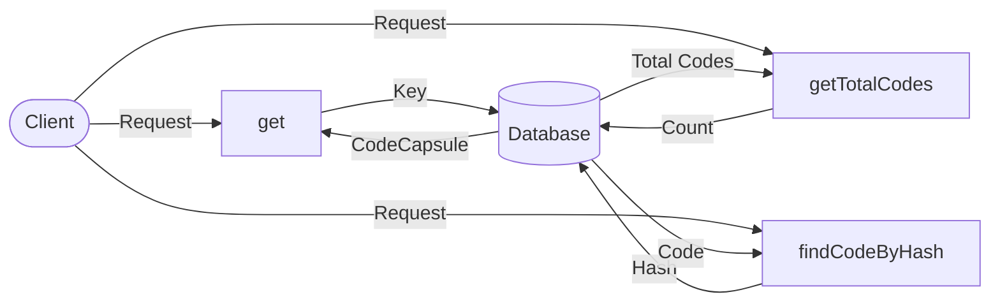

## Module: CodeStore.java
根据提供的代码模块，以下是以中文进行的综合分析：

- **模块名称**：CodeStore.java

- **主要目标**：该模块的目的是提供一个存储和检索智能合约代码的机制，使得智能合约代码可以高效、安全地被访问和管理。

- **关键功能**：
  - `get(byte[] key)`：通过键（key）获取相应的智能合约代码封装（CodeCapsule）。
  - `getTotalCodes()`：获取存储中智能合约代码的总数量。
  - `findCodeByHash(byte[] hash)`：通过哈希值查找对应的智能合约代码。

- **关键变量**：
  - `dbName`：用于标识存储数据库的名称。
  - `revokingDB`：一个可撤销的数据库实例，用于存储和管理智能合约代码。

- **相互依赖性**：该模块依赖于`TronStoreWithRevoking`类来实现对智能合约代码的存储和撤销操作，同时也依赖于Spring框架提供的依赖注入（DI）机制来实现其功能。

- **核心与辅助操作**：
  - 核心操作包括存储、检索和管理智能合约代码。
  - 辅助操作可能包括日志记录和错误处理。

- **操作顺序**：通常，操作顺序开始于智能合约代码的存储，随后是通过键或哈希值的检索，以及对总代码数量的查询。

- **性能方面**：性能考虑可能包括数据库访问的效率、数据结构的选择以及缓存策略，以确保高效的数据存取。

- **可重用性**：CodeStore设计为可重用组件，可以轻松集成到需要智能合约代码存储和检索功能的其他系统或模块中。

- **使用**：该模块在需要存储、检索、管理智能合约代码的应用场景中使用，如区块链平台或智能合约开发环境。

- **假设**：在设计和实现该模块时，可能做出的假设包括智能合约代码的唯一性（通过键或哈希值标识）以及存储系统的可靠性和安全性。

这个分析概述了CodeStore模块的主要特征和功能，为理解和使用该模块提供了基础。
## Flow Diagram [via mermaid]

