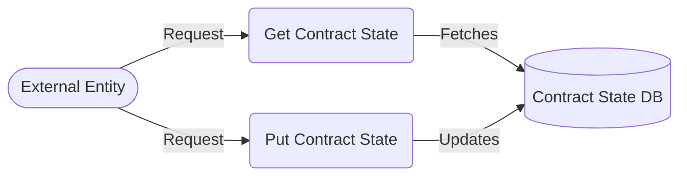

## Module: ContractStateStore.java
- **模块名称**：ContractStateStore.java

- **主要目标**：该模块的目的是为了管理和存储智能合约的状态信息。

- **关键功能**：
  - `get(byte[] key)`: 根据给定的键（通常是智能合约的地址或标识符）检索合约状态。
  - `put(byte[] key, ContractStateCapsule item)`: 将智能合约的状态信息存储或更新到数据库中。

- **关键变量**：
  - `dbName`: 数据库的名称，用于存储智能合约的状态。
  - `revokingDB`: 实现撤销操作的数据库实例，用于管理状态的变更。

- **互依赖性**：该模块依赖于`TronStoreWithRevoking`类来实现对撤销数据库的操作，同时也需要`ContractStateCapsule`类来封装智能合约的状态信息。

- **核心与辅助操作**：
  - 核心操作包括`get`和`put`方法，它们直接负责智能合约状态的检索和存储。
  - 辅助操作可能包括与数据库连接和管理相关的初始化和配置，这些在构造函数中实现。

- **操作序列**：首先通过构造函数初始化数据库名称和连接，然后通过`get`和`put`方法进行数据的检索和存储。

- **性能方面**：性能考虑主要集中在数据库的读写效率上，特别是在高并发场景下对智能合约状态进行快速检索和更新的能力。

- **可重用性**：该模块设计为可重用的组件，可以在需要管理智能合约状态的不同部分和项目中使用。

- **使用**：在区块链平台中，特别是在Tron网络中，用于维护智能合约的生命周期，包括部署、执行和查询合约状态。

- **假设**：
  - 假设智能合约的状态可以通过键值对的形式有效地存储和检索。
  - 假设在使用该模块之前已经正确配置了数据库环境。

这个分析提供了对`ContractStateStore.java`模块功能和设计的全面理解，突出了它在智能合约状态管理中的关键作用。
## Flow Diagram [via mermaid]

