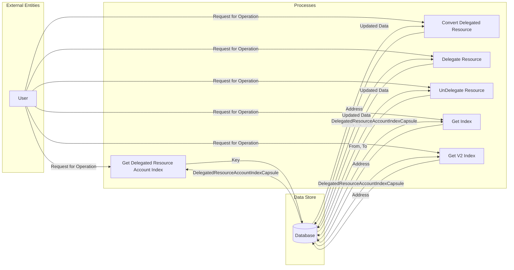

## Module: DelegatedResourceAccountIndexStore.java
- **模块名称**：DelegatedResourceAccountIndexStore.java

- **主要目标**：此模块的目的是管理和存储代理资源账户索引信息，以便有效地查询和更新代理资源的分配情况。

- **关键功能**：
  - `get(byte[] key)`：根据给定的键（地址）获取代理资源账户索引的封装信息。
  - `convert(byte[] address)`：转换给定地址的代理资源账户索引数据。
  - `delegate(byte[] from, byte[] to, long time)` 和 `delegateV2(byte[] from, byte[] to, long time)`：分别为代理资源分配操作，将资源从一个账户代理到另一个账户，并记录时间戳。
  - `unDelegate(byte[] from, byte[] to)` 和 `unDelegateV2(byte[] from, byte[] to)`：分别为取消代理资源分配的操作。
  - `getIndex(byte[] address)` 和 `getV2Index(byte[] address)`：获取给定地址的代理资源账户索引信息，包括V1和V2版本。

- **关键变量**：
  - `FROM_PREFIX` 和 `TO_PREFIX`：用于区分代理来源和目的地的前缀。
  - `V2_FROM_PREFIX` 和 `V2_TO_PREFIX`：V2版本的代理来源和目的地前缀。

- **相互依赖性**：此模块依赖于TronStoreWithRevoking类的功能，用于执行数据库的增删查改操作，并且与其他存储代理资源相关的模块有交互。

- **核心与辅助操作**：核心操作包括代理资源的分配（delegate/delegateV2）和取消（unDelegate/unDelegateV2），辅助操作包括获取代理资源账户索引信息（getIndex/getV2Index）。

- **操作序列**：通常，操作开始于代理资源的分配或取消，随后可能会查询代理资源账户索引信息以验证操作结果。

- **性能方面**：性能考虑主要涉及到数据存储和检索的效率，特别是在处理大量代理资源分配时的性能优化。

- **可重用性**：此模块设计有良好的封装性，可以在需要管理代理资源账户索引信息的其他场景下重用。

- **使用**：主要用于Tron区块链系统中，管理和查询代理资源（如带宽和能量）的分配情况。

- **假设**：假设所有输入的地址都是有效的，并且在代理资源操作之前已经进行了必要的验证。
## Flow Diagram [via mermaid]

