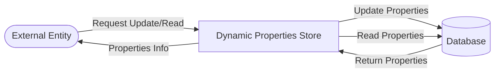

## Module: DynamicPropertiesStore.java
由于代码量较大，以下是基于给定代码模块的综合分析，内容将以中文呈现：

- **模块名称**：DynamicPropertiesStore.java

- **主要目标**：该模块的主要目的是管理和存储区块链动态属性（例如，最新区块头时间戳、最新区块号等），以支持区块链的运行和维护。

- **关键功能**：
  - `save` 和 `get` 方法：用于存储和检索各种动态属性。
  - `updateNextMaintenanceTime`：更新下一次维护时间。
  - `addTotalNetWeight`、`addTotalEnergyWeight` 等：用于更新网络权重和能量权重。
  - `forked` 和 `getForked`：管理和检索分叉信息。

- **关键变量**：
  - 如 `LATEST_BLOCK_HEADER_TIMESTAMP`、`LATEST_BLOCK_HEADER_NUMBER`、`STATE_FLAG` 等，这些变量用于标识各种动态属性的键值。

- **相互依赖性**：
  - 该模块与区块链的其他组成部分（如区块处理逻辑、交易处理逻辑等）紧密相关，通过更新和检索动态属性来支持区块链的正常运行。

- **核心与辅助操作**：
  - 核心操作包括维护区块链的动态属性，如时间戳、区块号等。
  - 辅助操作可能包括与分叉管理相关的功能，如 `forked`、`getForked`。

- **操作序列**：
  - 通常，当新区块被创建或验证时，会更新相关的动态属性，如最新区块头时间戳和区块号。

- **性能方面**：
  - 性能考虑主要集中在高效地存储和检索动态属性上，以确保区块链操作的高效执行。

- **可重用性**：
  - 该模块设计为通用的动态属性存储解决方案，可在不同的区块链项目中重用和扩展。

- **使用**：
  - 在区块链操作（如区块创建、交易处理等）中，需要更新或检索动态属性时使用。

- **假设**：
  - 假设底层数据库提供了高效、可靠的存储机制。
  - 假设动态属性的更新遵循区块链网络的共识规则。

这个分析提供了对`DynamicPropertiesStore.java`模块功能和作用的概览，但详细的实现细节和具体的交互逻辑需要通过阅读代码和相关文档来进一步理解。
## Flow Diagram [via mermaid]

