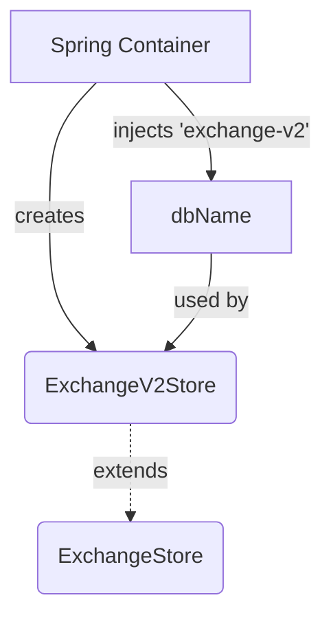

## Module: ExchangeV2Store.java
- **模块名称**：ExchangeV2Store.java

- **主要目标**：该模块的主要目的是为了扩展或定制ExchangeStore，专门处理与“exchange-v2”数据库相关的操作。它通过继承ExchangeStore类来实现其功能。

- **关键功能**：
  - 构造函数：通过接收一个数据库名称（"exchange-v2"）并将其传递给父类（ExchangeStore）的构造函数，来初始化ExchangeV2Store实例。

- **关键变量**：
  - dbName：这是传递给父类构造函数的数据库名称，用于指定这个特定实例将操作的数据库。

- **相互依赖性**：
  - 由于ExchangeV2Store继承自ExchangeStore，它依赖于ExchangeStore以及可能的其他系统组件（如数据库管理系统），用于执行其数据库操作。

- **核心与辅助操作**：
  - 核心操作：通过继承ExchangeStore，ExchangeV2Store的核心操作主要集中在数据库交互上，尤其是那些与“exchange-v2”数据库相关的操作。
  - 辅助操作：构造函数的作用虽然是基础性的，但对于确定具体操作的数据库来说是必不可少的。

- **操作序列**：
  - 在ExchangeV2Store实例化时，首先通过@Autowired注解自动注入dbName参数（"exchange-v2"），然后通过调用父类的构造函数完成对父类的初始化。

- **性能方面**：
  - 性能考虑可能包括数据库操作的效率，以及如何通过优化ExchangeStore的实现来提高ExchangeV2Store的性能。

- **可重用性**：
  - ExchangeV2Store的设计允许它通过简单地更换数据库名称来适应不同的数据库，这使得它在处理不同版本的交易数据库时具有较高的可重用性。

- **使用**：
  - ExchangeV2Store被用于操作与“exchange-v2”数据库相关的数据，例如查询、更新或删除交易信息。它通过Spring框架的依赖注入机制被集成到应用程序中。

- **假设**：
  - 该模块假设数据库已经存在并且可以通过指定的dbName（"exchange-v2"）访问。
  - 还假设父类ExchangeStore提供了所有必要的数据库操作方法，ExchangeV2Store不需要实现任何特定的数据库操作方法。
## Flow Diagram [via mermaid]

