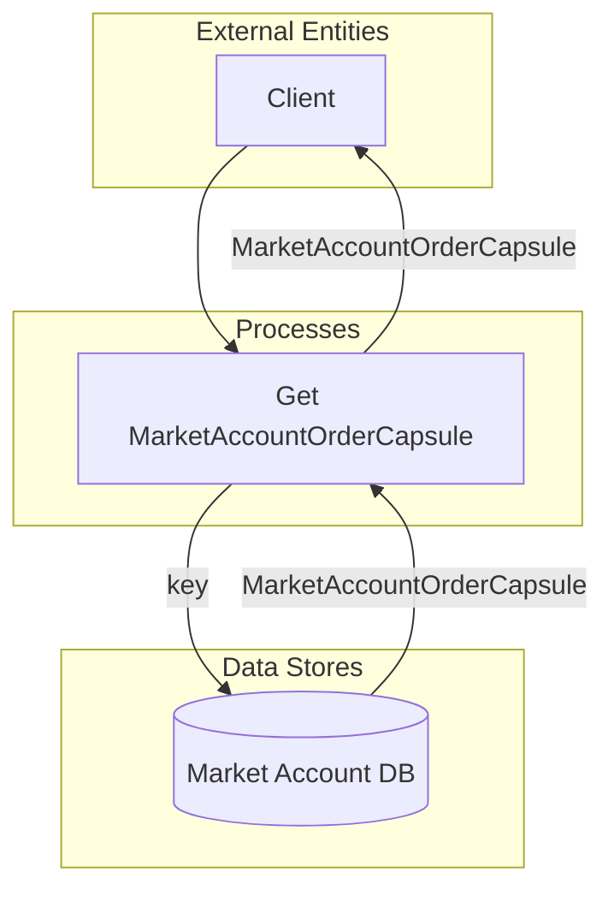

## Module: MarketAccountStore.java
- **模块名称**: MarketAccountStore.java

- **主要目标**: 该模块的目的是为了管理市场账户订单的存储和访问。它通过提供对市场账户订单数据的基本操作（如获取订单数据），支持市场交易功能的实现。

- **关键功能**:
  1. `get(byte[] key)`: 根据提供的键（订单ID）从数据库中检索对应的市场账户订单。如果找不到，会抛出`ItemNotFoundException`异常。

- **关键变量**:
  - `dbName`: 数据库名称，用于指定存储市场账户订单数据的数据库。
  
- **相互依赖性**: 该模块依赖于`TronStoreWithRevoking`类来实现对数据库的基本操作，如数据的获取。同时，它也可能与其他处理市场交易逻辑的组件有交互，尽管这些交互并未在代码片段中直接体现。

- **核心与辅助操作**: 核心操作是通过`get`方法获取市场账户订单数据。目前提供的代码中没有明确的辅助操作。

- **操作顺序**: 在这个简单的代码示例中，没有明确的操作顺序。主要操作是通过`get`方法直接访问数据库获取数据。

- **性能方面**: 性能考虑可能包括数据库访问的效率和`get`方法的响应时间。具体的性能表现会依赖于底层数据库的实现和配置。

- **可重用性**: 该模块通过封装市场账户订单的存取逻辑，具有一定的可重用性。它可以被任何需要进行市场账户订单管理的组件使用。

- **使用方式**: 其他需要管理市场账户订单的组件可以通过依赖注入的方式使用`MarketAccountStore`，利用它提供的`get`方法来获取订单数据。

- **假设**:
  - 假设数据库已经正确配置，并且市场账户订单数据结构已经定义。
  - 假设调用`get`方法的用户会处理可能抛出的`ItemNotFoundException`异常。
## Flow Diagram [via mermaid]

