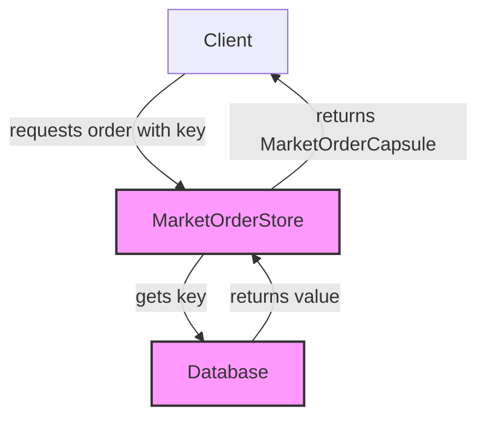

## Module: MarketOrderStore.java
- **模块名称**: MarketOrderStore.java

- **主要目标**: 该模块的主要目标是提供一个存储和检索市场订单数据（MarketOrderCapsule）的机制。它继承自TronStoreWithRevoking，允许对存储在数据库中的市场订单进行管理。

- **关键函数**:
  - `MarketOrderStore(String dbName)`: 构造函数，负责初始化数据库名称。
  - `get(byte[] key)`: 根据提供的键（订单ID）检索市场订单。如果找不到对应的订单，将抛出`ItemNotFoundException`异常。

- **关键变量**:
  - `dbName`: 用于存储市场订单数据的数据库名称。

- **相互依赖性**: 该模块依赖于`TronStoreWithRevoking`来实现撤销机制，同时也依赖于Spring框架提供的依赖注入（`@Autowired`）来初始化数据库连接。此外，它还依赖于`MarketOrderCapsule`类来处理市场订单数据。

- **核心与辅助操作**: 核心操作是市场订单的存储和检索，特别是通过`get`方法检索市场订单。辅助操作包括使用Spring框架进行依赖注入和数据库名称的初始化。

- **操作序列**: 在使用此模块之前，必须先通过构造函数初始化数据库名称，然后才能使用`get`方法检索市场订单。

- **性能方面**: 性能考虑包括数据库访问速度和数据检索效率。由于使用了撤销数据库（revokingDB），还需要考虑到撤销操作的性能影响。

- **可重用性**: 该模块设计为可重用的组件，可以在需要管理市场订单数据的任何地方使用。其通过通用的接口和灵活的数据库名称配置，增强了其在不同场景下的适应性。

- **使用**: 该模块主要用于Tron区块链平台中，用于存储和检索市场订单，支持交易系统的运行。

- **假设**: 在设计此模块时的假设包括：
  - 假设数据库操作是高效且可靠的。
  - 假设使用者已经熟悉Tron区块链平台的基本概念，如市场订单等。
  - 假设在市场订单数据结构（MarketOrderCapsule）没有发生变化的情况下，此模块能够正常工作。
## Flow Diagram [via mermaid]

