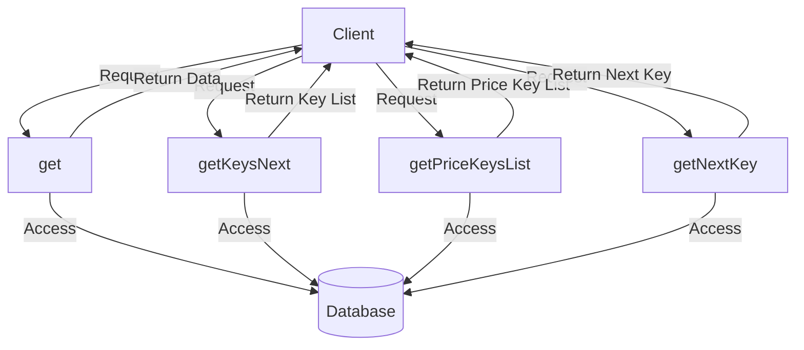

## Module: MarketPairPriceToOrderStore.java
基于提供的代码模块，以下是用中文进行的综合分析：

- **模块名称**：MarketPairPriceToOrderStore.java

- **主要目标**：该模块的目的是为了管理和存储市场交易对价格到订单的映射关系。

- **关键函数**：
  - `getOptionsByDbNameForLevelDB(String dbName)`：根据数据库名称为LevelDB配置选项，包括设置比较器。
  - `getDirectComparator()`：获取RockDB的直接比较器。
  - `get(byte[] key)`：通过键获取市场订单ID列表。
  - `getKeysNext(byte[] key, long limit)`：获取指定key之后的若干个键。
  - `getPriceKeysList(byte[] sellTokenId, byte[] buyTokenId, long count)`：获取指定卖出和买入代币ID的价格键列表。
  - `getPriceKeysList(byte[] headKey, long count, long totalCount, boolean skip)`：获取价格键列表，支持跳过头键。
  - `getNextKey(byte[] key)`：获取给定键的下一个键。

- **关键变量**：
  - `dbName`：数据库名称，用于标识特定的存储空间。
  
- **依赖关系**：
  - 该模块依赖于`TronStoreWithRevoking`进行数据存储操作。
  - 使用了`MarketOrderPriceComparatorForLevelDB`和`MarketOrderPriceComparatorForRockDB`作为数据库的比较器。
  - 依赖于`MarketUtils`来获取交易对价格的头键。

- **核心与辅助操作**：
  - 核心操作包括管理价格到订单的映射关系，如获取和存储订单ID列表。
  - 辅助操作包括提供特定的数据库配置和比较器设置。

- **操作序列**：
  - 通常，操作开始于通过特定的键获取订单ID列表，或者通过交易对信息获取价格键列表。

- **性能方面**：
  - 性能考虑主要集中在数据库操作的效率上，包括键的查询和数据的读写。
  - 使用合适的比较器来优化查询性能。

- **可重用性**：
  - 该模块设计了通用的接口和方法，使其可以在不同的市场交易对场景下重用。

- **使用**：
  - 该模块主要被用于支持交易平台或区块链系统中的市场价格查询和订单管理。

- **假设**：
  - 假定所有的输入键和ID都是有效的。
  - 假设对于每个交易对，都有一个唯一的头键用于索引。

通过以上分析，可以看出`MarketPairPriceToOrderStore`模块是一个关键组件，用于管理交易对的价格和订单关系，支持高效的数据存储和查询操作。
## Flow Diagram [via mermaid]

