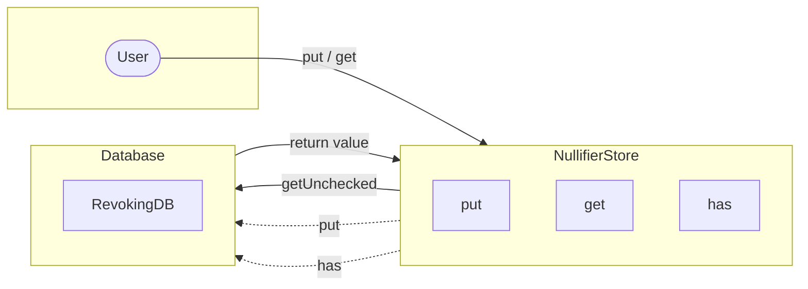

## Module: NullifierStore.java
- **模块名称**: NullifierStore.java

- **主要目标**: 该模块的主要目的是提供一个专门存储和检索Nullifier（防重放标记）的机制，以确保区块链交易的唯一性和安全性。

- **关键功能**:
  - `put(BytesCapsule bytesCapsule)`: 将Nullifier存储到数据库中。
  - `get(byte[] key)`: 根据给定的键（Nullifier）检索相应的值。
  - `has(byte[] key)`: 检查数据库中是否存在给定键的Nullifier。

- **关键变量**:
  - `dbName`: 数据库的名称，用于存储Nullifier。

- **相互依赖性**: 该模块依赖于`TronStoreWithRevoking`类来实现撤销机制，同时也依赖于`BytesCapsule`类来封装存储的数据。

- **核心与辅助操作**:
  - 核心操作包括`put`、`get`和`has`方法，它们直接与Nullifier的存储和检索相关。
  - 辅助操作可能包括与数据库连接和数据封装相关的操作。

- **操作序列**:
  - 通常，首先通过`put`方法存储Nullifier。
  - 然后，可以使用`get`方法检索Nullifier，或使用`has`方法检查其是否存在。

- **性能方面**:
  - 性能考虑可能包括确保快速的数据存取速度和高效的空间使用率。
  - 使用`revokingDB.getUnchecked(key)`方法来避免不必要的检查，以提高性能。

- **可重用性**:
  - 该模块被设计为通用的Nullifier存储解决方案，可以在需要处理防重放标记的不同场景中重用。

- **使用方式**:
  - 在需要确保交易或其他数据项唯一性的区块链应用中，通过`NullifierStore`存储和检索Nullifier来防止重放攻击。

- **假设**:
  - 假设存储的Nullifier是唯一的，并且每个Nullifier只对应一个交易或数据项。
  - 假设系统的用户或开发者理解Nullifier的重要性，并正确地使用`put`、`get`和`has`方法来管理它们。
## Flow Diagram [via mermaid]

