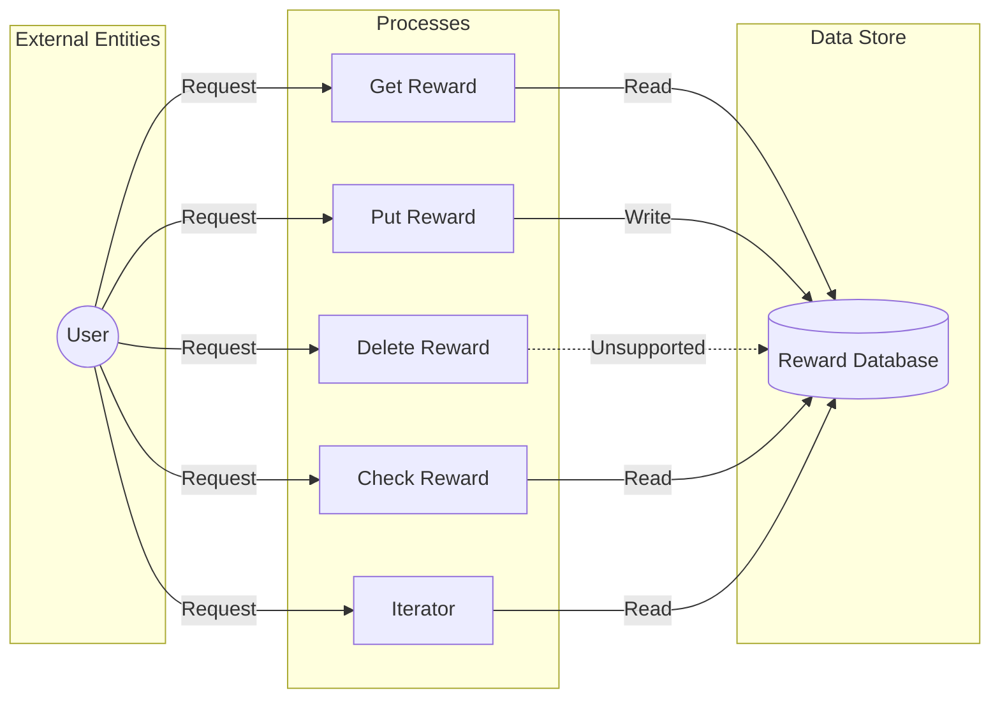

## Module: RewardViStore.java
- **模块名称**：RewardViStore.java

- **主要目标**：该模块的目的是提供一个专门用于处理奖励视图存储的接口，使得可以高效地存取、更新和查询奖励数据。

- **关键函数**：
  - `get(byte[] key)`：根据给定的键获取相应的数据。
  - `put(byte[] key, byte[] item)`：将给定的键值对存储到数据库中。
  - `delete(byte[] key)`：删除指定键的数据，当前实现中不支持此操作，会抛出`UnsupportedOperationException`。
  - `has(byte[] key)`：检查数据库中是否存在给定键的数据。
  - `iterator()`：返回一个数据库迭代器，用于遍历数据库中的数据。

- **关键变量**：
  - `dbSource`：数据库源，是与底层数据库交互的主要接口。

- **相互依赖性**：该模块依赖于`TronDatabase`类来实现基本的数据库操作功能，同时也依赖于Spring框架提供的依赖注入和配置管理功能。

- **核心与辅助操作**：
  - 核心操作包括数据的增、查功能，即`put`和`get`方法。
  - 辅助操作包括检查数据存在(`has`)与数据遍历(`iterator`)。

- **操作序列**：典型的使用序列是首先检查某个键是否存在（使用`has`方法），然后根据需要读取（`get`）或更新（`put`）数据。由于`delete`操作不被支持，删除数据的需求需要通过其他机制解决。

- **性能方面**：在设计时需要考虑到数据库操作的性能，尤其是数据的读取和写入效率。由于直接与底层数据库交互，性能也受到所使用数据库性能的影响。

- **可重用性**：该模块通过抽象和封装数据库操作，提高了代码的可重用性。它可以被不同的项目或模块用于管理类似的奖励数据。

- **使用**：该模块被用于管理与奖励相关的数据，如用户的奖励记录。它通过提供简洁的API接口，简化了数据存取过程。

- **假设**：在设计和实现这个模块时，有几个假设：
  - 数据库操作是可靠的，不会出现数据丢失或损坏的情况。
  - 性能需求不会随着数据量的增加而成为瓶颈。
  - 使用的数据库提供了必要的事务支持和并发控制机制。
## Flow Diagram [via mermaid]

