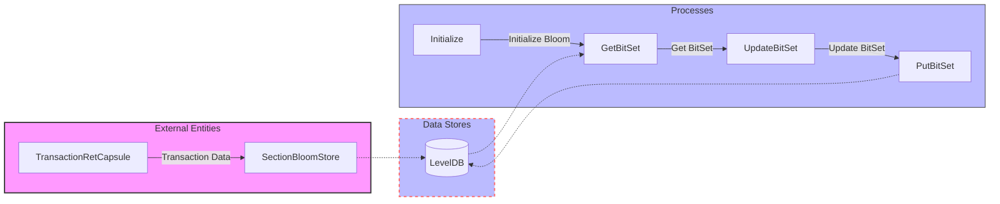

## Module: SectionBloomStore.java
模块名称：SectionBloomStore.java

**主要目标**：
这个模块的目的是为了管理和存储区块链中各个区块的Bloom过滤器数据。它允许快速检索和更新与交易相关的事件数据，以优化查询效率和提高数据访问速度。

**关键功能**：
- `get(byte[] key)`：根据给定的键（key）检索存储的BytesCapsule。
- `has(byte[] key)`：检查给定键（key）的数据是否存在。
- `combineKey(int section, int bitIndex)`：组合区段号和位索引以形成唯一的键。
- `get(int section, int bitIndex)`：根据区段号和位索引获取对应的BitSet。
- `put(int section, int bitIndex, BitSet bitSet)`：将BitSet存储到指定的区段和位索引位置。
- `initBlockSection(TransactionRetCapsule transactionRetCapsule)`：初始化区块段的Bloom过滤器。
- `write(long blockNum)`：将Bloom过滤器数据写入存储。

**关键变量**：
- `BLOCK_PER_SECTION`：每个区段包含的区块数量。
- `bitList`：用于存储Bloom过滤器中设置的位的索引。

**依赖性**：
这个模块依赖于`TronStoreWithRevoking`类来实现数据的存储和撤销操作，还依赖于`ByteUtil`类来执行数据的压缩和解压缩。

**核心与辅助操作**：
核心操作包括Bloom过滤器的初始化、读取、更新和写入。辅助操作包括键的组合和数据的压缩与解压缩。

**操作序列**：
1. 初始化Bloom过滤器。
2. 根据需要读取或更新Bloom过滤器数据。
3. 将更新后的数据写回存储。

**性能方面**：
性能考虑包括数据压缩和解压缩的效率，以及通过减少数据访问和检索时间来优化查询性能。

**可重用性**：
这个模块的设计允许它被重用于管理任何需要Bloom过滤器的场景，不仅限于交易事件数据。

**使用**：
该模块在区块链系统中用于快速检索和更新与交易相关的事件数据，以优化查询效率和提高数据访问速度。

**假设**：
- 假设每个区块的事件数据可以有效地映射到Bloom过滤器中。
- 假设系统中的其他组件能够提供必要的交易数据和区块编号。
## Flow Diagram [via mermaid]

