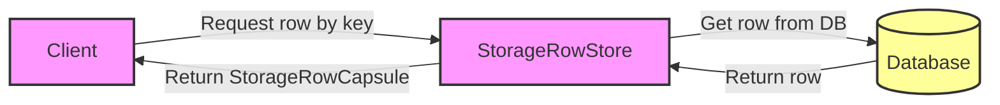

## Module: StorageRowStore.java
- **模块名称**：StorageRowStore.java

- **主要目标**：该模块的目的是提供对存储行数据（StorageRowCapsule）的访问和管理。它继承自TronStoreWithRevoking，专门处理存储行级别的数据操作。

- **关键函数**：
  - `StorageRowStore(String dbName)`：构造函数，初始化数据库名称。
  - `get(byte[] key)`：根据给定的键获取存储行数据，如果存在则返回StorageRowCapsule对象。

- **关键变量**：
  - `dbName`：数据库名称，用于初始化存储的位置。
  
- **依赖关系**：
  - 该模块依赖于`TronStoreWithRevoking`来实现撤销机制和数据库操作。
  - 依赖于`StorageRowCapsule`来封装存储行数据。
  - 通过Spring框架的`@Autowired`和`@Value`注解依赖注入数据库名称和其他配置。

- **核心与辅助操作**：
  - 核心操作包括数据的获取（`get`方法）。
  - 辅助操作可能包括构造函数中的数据库初始化。

- **操作序列**：
  - 首先通过构造函数初始化数据库名称。
  - 然后，可以通过`get`方法根据键值获取存储行的数据。

- **性能方面**：
  - 性能考虑可能包括对数据库访问的优化，以及如何高效地管理存储行数据的获取。

- **可重用性**：
  - 该模块设计为可重用的组件，可以在需要管理存储行数据的其他部分中重用。

- **使用**：
  - 用于访问和管理存储行数据，特别是在需要从数据库中获取或操作这些数据的场景中。

- **假设**：
  - 假设存储行数据已经按照一定的格式存储在数据库中。
  - 假设调用者负责处理`get`方法返回的`StorageRowCapsule`对象。

通过上述分析，我们可以看到StorageRowStore模块是Tron区块链框架中用于处理存储行数据访问和管理的关键组件。它通过提供基本的数据访问方法，支持了高效且可重用的数据管理操作。
## Flow Diagram [via mermaid]

