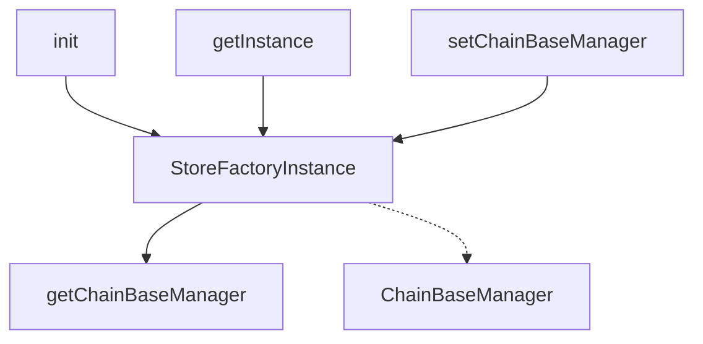

## Module: StoreFactory.java
- **模块名称**: StoreFactory.java

- **主要目的**: 该模块的主要目的是提供一个工厂类，用于管理和创建与区块链基础管理（ChainBaseManager）相关的存储实例。它采用单例模式确保整个应用中只有一个StoreFactory实例。

- **关键功能**:
  - `init()`: 初始化StoreFactory的静态实例。
  - `getInstance()`: 返回StoreFactory的单例对象。
  - `getChainBaseManager()`: 获取当前的ChainBaseManager实例。
  - `setChainBaseManager(ChainBaseManager chainBaseManager)`: 设置ChainBaseManager实例。

- **关键变量**:
  - `INSTANCE`: StoreFactory类的单例实例。
  - `chainBaseManager`: ChainBaseManager实例，管理区块链的基础数据。

- **相互依赖性**: 该模块与ChainBaseManager紧密相关，依赖ChainBaseManager来管理区块链的基础数据和存储。

- **核心与辅助操作**:
  - 核心操作包括管理ChainBaseManager实例的获取和设置。
  - 辅助操作包括初始化和获取StoreFactory的单例实例。

- **操作序列**: 首先通过`init()`方法初始化StoreFactory的实例，然后可以通过`getInstance()`获取其单例，之后通过`setChainBaseManager()`设置ChainBaseManager实例，最后通过`getChainBaseManager()`获取ChainBaseManager实例。

- **性能方面**: 作为一个采用单例模式的工厂类，StoreFactory可能会在多线程环境下面临同步问题，但由于其主要操作较为简单，性能影响有限。

- **可重用性**: StoreFactory设计为通用的工厂类，可在需要管理不同类型的存储实例时重用。

- **使用方式**: 在应用启动时，首先调用`StoreFactory.init()`初始化单例，然后通过`StoreFactory.getInstance()`获取实例，并通过其设置和获取ChainBaseManager实例来管理区块链存储。

- **假设**:
  - 假设在整个应用的生命周期中，只需要一个StoreFactory实例来管理存储实例。
  - 假设调用`init()`方法初始化实例之前，不会调用`getInstance()`方法获取实例。
## Flow Diagram [via mermaid]

