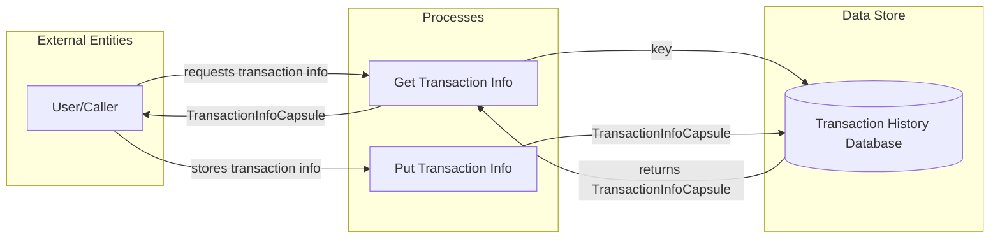

## Module: TransactionHistoryStore.java
- **模块名称**：TransactionHistoryStore.java

- **主要目标**：该模块的目的是为了管理和存储交易历史信息，确保交易信息的持久化存储和快速访问。

- **关键函数**：
  - `get(byte[] key)`：通过交易的键（通常是交易ID）来检索交易信息。如果找不到对应的值，则返回null。
  - `put(byte[] key, TransactionInfoCapsule item)`：将交易信息存储到数据库中。如果开启了交易历史存储功能，则执行存储操作。

- **关键变量**：
  - `dbName`：数据库名称，指定了存储交易历史的数据库。
  
- **依赖关系**：
  - 该模块依赖于`TronStoreWithRevoking`类来实现撤销机制，并通过`revokingDB`实现对交易信息的存取。
  - 依赖于`CommonParameter`来获取配置信息，比如是否开启交易历史存储功能。

- **核心 vs. 辅助操作**：
  - 核心操作包括交易信息的存储（`put`方法）和检索（`get`方法）。
  - 辅助操作可能包括与配置参数的交互，以及处理存储时的异常情况。

- **操作序列**：
  - 在`put`操作中，首先检查是否开启了交易历史存储开关，如果开启，则将交易信息存储到数据库中。
  - `get`操作直接从数据库中检索交易信息，如果找不到则返回null。

- **性能方面**：
  - 性能考虑可能包括对数据库的读写效率，以及如何有效地处理大量的交易信息存储和检索。

- **可重用性**：
  - 该模块设计为可重用组件，可以在需要管理交易历史的其他部分或项目中使用。

- **使用**：
  - 主要用于区块链系统中，管理和存储交易的历史信息，为系统提供交易数据的持久化和快速访问能力。

- **假设**：
  - 假设数据库配置正确，并且系统配置了正确的交易历史存储开关。
  - 假设交易ID是唯一的，可以作为存储和检索交易信息的键。
## Flow Diagram [via mermaid]

