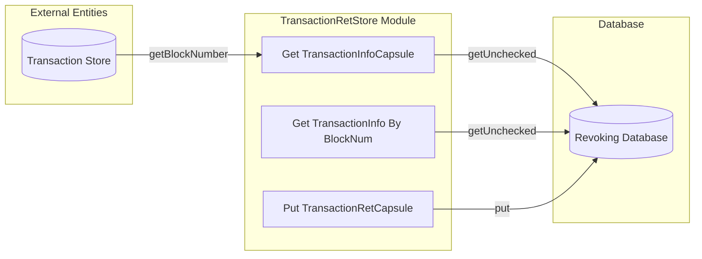

## Module: TransactionRetStore.java
**模块名称**：TransactionRetStore.java

**主要目标**：该模块的目的是提供与交易结果相关的存储和检索功能，支持Tron区块链平台上的交易处理。

**关键函数**：
- `put(byte[] key, TransactionRetCapsule item)`：将交易结果存储到数据库中，但仅当配置允许存储交易历史时。
- `getTransactionInfo(byte[] key)`：根据交易的键（通常是交易ID）检索交易信息。
- `getTransactionInfoByBlockNum(byte[] key)`：根据区块编号检索交易结果。

**关键变量**：
- `transactionStore`：用于访问交易存储，以获取特定交易相关的区块编号。
- `dbName`：数据库名称，用于初始化存储。

**交互依赖**：
- 与`TransactionStore`类交互以获取交易所在区块的编号。
- 依赖于`TronStoreWithRevoking`来实现撤销功能。

**核心与辅助操作**：
- 核心操作包括存储和检索交易结果信息。
- 辅助操作可能包括处理配置参数以确定是否启用交易历史存储。

**操作序列**：
1. 检查是否启用交易历史存储。
2. 存储或检索交易结果信息。
3. 处理特定查询，如通过交易ID或区块编号获取交易信息。

**性能方面**：
- 性能考虑可能包括优化数据存取效率，特别是在高频访问场景下。
- 对于大量的交易数据，确保数据库操作的性能至关重要。

**可重用性**：
- 此模块设计为可重用，可以在需要处理交易结果存储和检索的任何Tron区块链项目中使用。

**使用**：
- 在Tron区块链平台的节点软件中使用，用于管理交易的结果数据。

**假设**：
- 假设数据库已正确配置且可用。
- 假设交易ID是检索交易信息的有效键。
- 假设系统配置允许根据需要启用或禁用交易历史的存储。

通过详细分析这个模块，我们可以看到它在Tron区块链系统中扮演了重要角色，特别是在交易结果的存储和检索方面，对于确保区块链的完整性和可追溯性至关重要。
## Flow Diagram [via mermaid]

