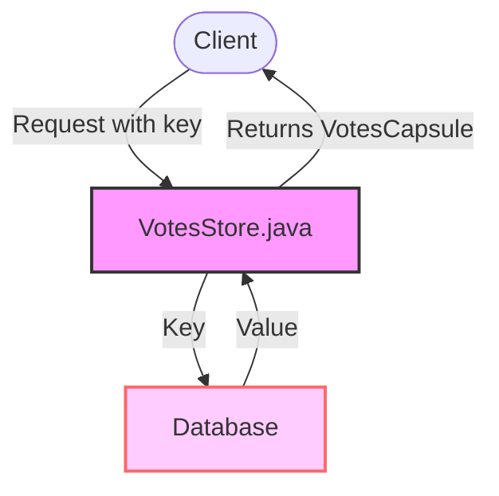

## Module: VotesStore.java
**模块名称**：VotesStore.java

**主要目标**：该模块的目的是提供对投票数据的存储和访问功能。它是处理投票信息（如存储和检索投票）的关键组件。

**关键功能**：
- 构造函数（VotesStore）：通过数据库名称初始化存储。
- get方法：根据给定的键（byte数组）从数据库中检索投票信息。如果找到相应的值，则返回一个VotesCapsule对象；如果没有找到或值为空，则返回null。

**关键变量**：
- dbName：数据库名称，用于指定存储投票信息的数据库。
- revokingDB：继承自TronStoreWithRevoking，用于操作底层数据库。

**相互依赖性**：该模块依赖于`TronStoreWithRevoking`类来执行数据库的基本操作，如数据的检索。它还使用了`VotesCapsule`类来封装投票信息。

**核心与辅助操作**：
- 核心操作包括使用get方法检索投票信息。
- 该模块未明确列出辅助操作，但可以认为初始化和配置（如通过构造函数指定数据库名称）是辅助操作。

**操作序列**：操作的主要流程是通过get方法调用来检索特定键的投票信息，这涉及到从底层数据库中获取数据并将其封装到VotesCapsule对象中。

**性能方面**：性能考虑可能包括对数据库访问的优化，例如确保高效的数据检索和最小化延迟。get方法的实现需要考虑到空值检查和数据封装的效率。

**可重用性**：该模块通过提供一个标准接口来操作投票数据，具有较高的可重用性。它可以被用于任何需要投票信息存储和检索的Tron网络组件中。

**使用**：该模块主要被用于Tron区块链框架中，用于处理与投票相关的数据存储需求，如在区块链治理过程中记录和检索用户投票。

**假设**：
- 假设底层数据库已经正确配置并且可用。
- 假设传入的键值对于检索的投票信息是有效和唯一的。

通过上述分析，我们可以看出VotesStore模块是Tron区块链框架中处理投票信息的关键组件，它通过提供简洁的接口来支持高效的数据存储和检索操作。
## Flow Diagram [via mermaid]

