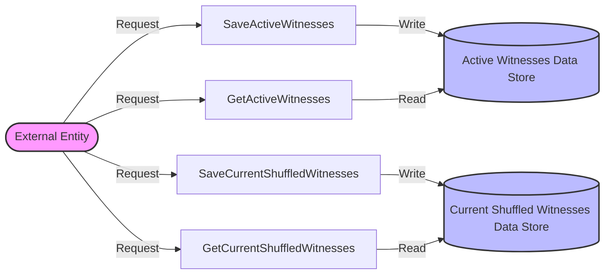

## Module: WitnessScheduleStore.java
- **模块名称**: WitnessScheduleStore.java

- **主要目标**: 该模块的目的是为了管理见证人的调度信息，包括活跃见证人和当前洗牌后的见证人列表。

- **关键功能**:
  - `saveData`: 保存见证人地址列表到数据库。
  - `getData`: 从数据库获取见证人地址列表。
  - `saveActiveWitnesses`: 保存活跃见证人列表。
  - `getActiveWitnesses`: 获取活跃见证人列表。
  - `saveCurrentShuffledWitnesses`: 保存当前洗牌后的见证人列表。
  - `getCurrentShuffledWitnesses`: 获取当前洗牌后的见证人列表。

- **关键变量**:
  - `ACTIVE_WITNESSES`: 用于标识活跃见证人的键。
  - `CURRENT_SHUFFLED_WITNESSES`: 用于标识当前洗牌后见证人的键。
  - `ADDRESS_BYTE_ARRAY_LENGTH`: 地址字节数组的长度。

- **相互依赖性**: 该模块依赖于`TronStoreWithRevoking`来实现数据的存储与获取，同时使用了`BytesCapsule`来封装见证人地址列表的数据。

- **核心与辅助操作**:
  - 核心操作包括保存和获取见证人地址列表。
  - 辅助操作包括日志记录和异常处理。

- **操作序列**:
  1. 通过`saveData`方法保存见证人地址列表。
  2. 通过`getData`方法获取见证人地址列表。
  3. 提供特定的方法（如`saveActiveWitnesses`和`getActiveWitnesses`）来处理特定类型的见证人列表。

- **性能方面**: 在处理见证人地址列表时，需要注意数据的读写效率和异常处理。

- **可重用性**: 该模块具有较高的可重用性，可以在需要管理见证人调度信息的场景下使用。

- **使用**: 通过调用提供的公共方法，可以在区块链网络中管理和调度见证人，以确保网络的正常运行和安全。

- **假设**:
  - 假设见证人地址列表的数据结构是固定的，每个地址的长度都是`ADDRESS_BYTE_ARRAY_LENGTH`定义的长度。
  - 假设在调用`saveData`和`getData`方法时，传入的键（`ACTIVE_WITNESSES`或`CURRENT_SHUFFLED_WITNESSES`）是正确的，以确保数据的准确性。
## Flow Diagram [via mermaid]

