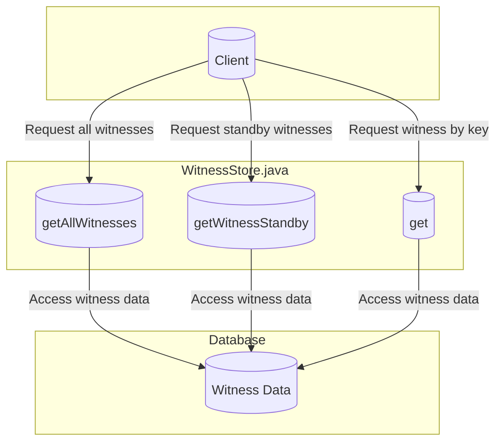

## Module: WitnessStore.java
- **模块名称**：WitnessStore.java

- **主要目标**：该模块的目的是管理和存储见证人（Witness）信息。

- **关键功能**：
  - `getAllWitnesses()`：获取所有见证人信息。
  - `get(byte[] key)`：通过key获取特定的见证人信息。
  - `getWitnessStandby()`：获取备选见证人列表。

- **关键变量**：
  - `dbName`：数据库名称，用于初始化存储。

- **依赖性**：该模块依赖于`TronStoreWithRevoking`类来执行数据库的基本操作，并且使用了`WitnessCapsule`来封装见证人信息。

- **核心与辅助操作**：
  - 核心操作包括见证人信息的获取（`get`和`getAllWitnesses`）和备选见证人的筛选（`getWitnessStandby`）。
  - 辅助操作可能包括日志记录和错误处理等，这些通过继承`TronStoreWithRevoking`类实现。

- **操作序列**：首先通过`getAllWitnesses`获取所有见证人信息，然后`getWitnessStandby`根据投票数和其他条件筛选出备选见证人列表。

- **性能方面**：性能考虑可能包括处理大量见证人信息时的效率和数据库访问的优化。

- **可重用性**：此模块设计为可重用的组件，可以在需要管理见证人信息的不同部分的系统中使用。

- **使用**：主要用于Tron区块链系统中见证人的管理和选举过程。

- **假设**：
  - 假设所有见证人信息都是最新和有效的。
  - 假设在选举备选见证人时，投票数是决定因素之一。

这个分析基于提供的代码片段，详细说明了`WitnessStore.java`模块的关键方面和功能。
## Flow Diagram [via mermaid]

