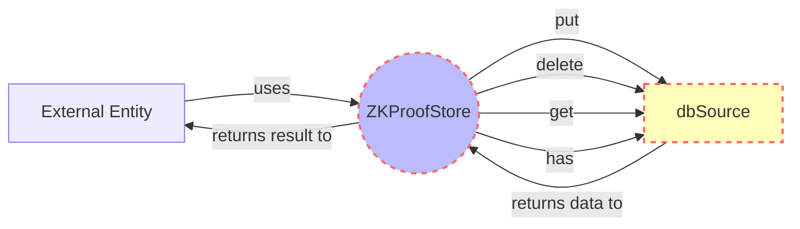

## Module: ZKProofStore.java
- **模块名称**：ZKProofStore.java

- **主要目标**：该模块的目的是提供一个存储和检索零知识证明（Zero-Knowledge Proofs）的功能，以支持区块链的隐私保护操作。

- **关键功能**：
  - `put(byte[] key, Boolean item)`：将零知识证明与其键值存储起来。
  - `delete(byte[] key)`：根据键值删除存储的零知识证明。
  - `get(byte[] key)`：根据键值检索零知识证明。
  - `has(byte[] key)`：检查特定键值的零知识证明是否存在。

- **关键变量**：
  - `dbSource`：数据库源，用于实际的数据存储操作。

- **相互依赖性**：该模块依赖于`TronDatabase`类来实现数据的存储功能，并通过`ApplicationContext`与Spring框架进行集成，以实现依赖注入。

- **核心与辅助操作**：
  - 核心操作包括`put`、`delete`、`get`、`has`方法，这些是直接与零知识证明数据交互的方法。
  - 辅助操作可能包括与`ApplicationContext`和`TronDatabase`的交互，这些是为了实现核心功能而必须的操作。

- **操作顺序**：通常，操作的顺序会从`put`方法开始，存储零知识证明，然后可以使用`get`或`has`方法进行检索或验证，最后可能使用`delete`方法进行清理。

- **性能方面**：性能考虑可能包括对数据库操作的优化，确保高效存取零知识证明，以及处理大量数据时的性能保障。

- **可重用性**：该模块设计为可重用组件，可以在需要管理零知识证明的不同区块链项目中使用。

- **使用**：在需要对零知识证明进行存储和检索的区块链应用中使用此模块，以支持隐私保护功能。

- **假设**：
  - 假设存储的零知识证明是有效的。
  - 假设使用者熟悉基本的区块链和零知识证明概念。
  - 假设数据库资源已经被正确配置和初始化。
## Flow Diagram [via mermaid]

