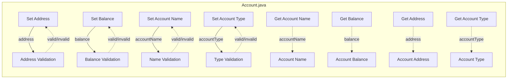

## Module: Account.java
- **模块名称**：Account.java

- **主要目标**：该模块的目的是定义和管理账户信息，包括账户名称、账户类型、地址和余额。

- **关键函数**：
  - `setAddress(byte[] address)`：设置账户地址，确保地址有效且为21字节。
  - `getBalance()`：获取账户余额。
  - `setBalance(String balance)`：设置账户余额，确保余额为长整型数据。
  - `getAccountName()`：获取账户名称。
  - `setAccountName(String accountName)`：设置账户名称，确保名称非空。
  - `getAccountType()` 和 `setAccountType(String accountType)`：获取和设置账户类型，确保类型为Normal/AssetIssue/Contract中的一种。
  - `isAccountType(String accountType)`：判断提供的账户类型是否有效。

- **关键变量**：
  - `accountName`：账户名称。
  - `accountType`：账户类型。
  - `address`：账户地址。
  - `balance`：账户余额。

- **交互依赖性**：该模块可能与系统中负责地址验证、余额处理和账户类型管理的其他组件交互。

- **核心与辅助操作**：
  - 核心操作包括管理账户的基本信息，如地址、余额、类型和名称。
  - 辅助操作可能包括类型验证和字符串处理。

- **操作序列**：在设置账户信息（如地址、余额和名称）时，会进行有效性验证，以确保数据的正确性和安全性。

- **性能方面**：性能考虑可能包括确保方法的效率，特别是在处理字符串和进行类型转换时。

- **可重用性**：由于该模块提供了基本的账户信息管理功能，它可以在需要管理账户信息的多个地方重用。

- **用途**：该模块主要用于在需要处理账户信息的场景中，如在区块链平台或相关应用程序中管理用户账户。

- **假设**：
  - 假设账户地址总是21字节长。
  - 假设账户余额可以转换为长整型数据。
  - 假设提供的账户类型总是Normal、AssetIssue或Contract中的一种。
## Flow Diagram [via mermaid]

