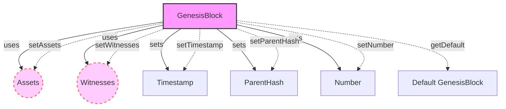

## Module: GenesisBlock.java
- **模块名称**：GenesisBlock.java

- **主要目标**：定义初始区块（Genesis Block）的结构和数据。在区块链技术中，初始区块是整个链的第一个区块，对于区块链的启动和运行至关重要。

- **关键功能**：
  - `getDefault()`：返回一个默认的初始区块实例。
  - `setAssets(final List<Account> assets)`：设置账户资产列表。
  - `setTimestamp(final String timestamp)`：设置区块的时间戳。
  - `setParentHash(final String parentHash)`：设置父区块的哈希值。
  - `setNumber(final String number)`：设置区块号为默认值"0"。
  - `setWitnesses(final List<Witness> witnesses)`：设置见证人列表。

- **关键变量**：
  - `assets`：账户资产列表。
  - `witnesses`：见证人列表。
  - `timestamp`：区块时间戳。
  - `parentHash`：父区块哈希值。
  - `number`：区块号。

- **相互依赖性**：此模块通过定义初始区块的结构，与系统中其他组件（如账户系统、见证人管理等）相互作用，为区块链的启动和数据一致性提供基础。

- **核心 vs. 辅助操作**：
  - 核心操作包括设置资产、见证人、时间戳、父哈希和区块号，这些是构成初始区块的基本要素。
  - 辅助操作可能包括对输入参数的校验等。

- **操作序列**：首先创建一个初始区块实例，然后可以通过提供的setter方法设置资产、见证人、时间戳、父哈希和区块号。

- **性能方面**：由于初始区块通常只在区块链启动时创建一次，性能考虑不是主要焦点。但是，确保数据的有效性和一致性是重要的。

- **可重用性**：这个模块主要针对特定的区块链实现，但通过修改和扩展，可以适应不同的区块链项目需求。

- **使用**：在区块链初始化或启动时，使用此模块来创建初始区块，为整个链设置起点和基本参数。

- **假设**：
  - 假设时间戳、父哈希和区块号在创建时被设置为默认值。
  - 假设资产和见证人列表初始为空，需要后续填充。
## Flow Diagram [via mermaid]

