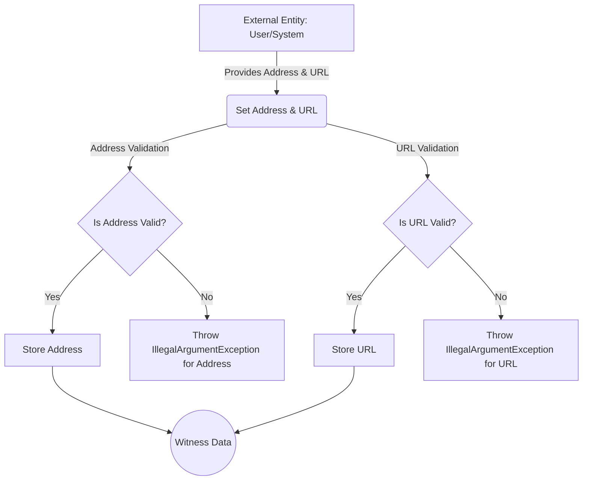

## Module: Witness.java
- **模块名称**：Witness.java

- **主要目标**：Witness类的目的是为了定义和管理见证人（区块链网络中的一个概念，通常指的是有权进行区块验证和生产的节点）的基本信息，包括地址、URL和投票数。

- **关键功能**：
  - `setAddress(byte[] address)`: 设置见证人的地址。如果地址不符合规定的格式（例如长度不是21字节），则抛出异常。
  - `setUrl(String url)`: 设置见证人的URL。如果URL为空或格式错误，则抛出异常。
  - `getAddress()`: 获取见证人的地址。
  - `getUrl()`: 获取见证人的URL。
  - `getVoteCount() / setVoteCount(long voteCount)`: 获取或设置见证人的投票数。

- **关键变量**：
  - `address`: 存储见证人的地址。
  - `url`: 存储见证人的URL。
  - `voteCount`: 存储见证人获得的投票数。

- **依赖关系**：该模块依赖于`org.tron.common.utils.DecodeUtil`来验证地址的有效性，还依赖于`org.apache.commons.lang3.StringUtils`和`org.tron.common.utils.StringUtil`来进行字符串操作。

- **核心与辅助操作**：
  - 核心操作包括设置和获取见证人的地址、URL和投票数。
  - 辅助操作包括地址和URL的格式验证。

- **操作序列**：首先，使用`setAddress`和`setUrl`方法来设置见证人的地址和URL。这两个方法内部会进行必要的格式验证。然后，可以通过`get`方法获取这些信息或通过`setVoteCount`方法更新投票数。

- **性能考虑**：性能方面可能需要考虑的是地址和URL的验证过程，尤其是在大量操作或需要频繁更新见证人信息的场景中。

- **可重用性**：Witness类设计得相对通用，可以在需要管理见证人信息的不同区块链项目中重用。

- **使用**：在java-tron这样的区块链项目中，Witness类用于管理网络中具有决策权的节点信息，这对于节点管理和投票机制等功能至关重要。

- **假设**：
  - 地址必须是21字节长，这是基于特定的区块链网络协议（如Tron）的要求。
  - URL和地址的格式正确性是通过抛出异常来强制的，假设使用者会相应地处理这些异常。
## Flow Diagram [via mermaid]

