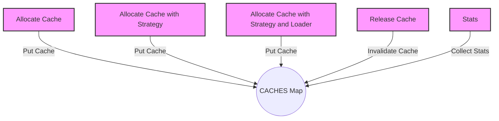

## Module: CacheManager.java
- **模块名称**: CacheManager.java

- **主要目标**: 此模块的目的是为系统提供一个灵活的缓存管理机制，允许动态地创建、配置和管理各种类型的缓存。

- **关键功能**:
  - `allocate`：根据缓存类型和策略动态分配缓存实例。
  - `release`：释放指定的缓存实例，清除所有缓存项。
  - `stats`：提供缓存的统计信息，如命中率、加载新值的平均时间等。

- **关键变量**:
  - `CACHES`：一个线程安全的Map，用于存储所有活跃的缓存实例。

- **相互依赖性**: 此模块依赖于Google Guava库中的`CacheLoader`和`CacheStats`，以及自定义的`TronCache`类和`CacheType`枚举。它还依赖于`CommonParameter`类来获取缓存策略配置。

- **核心与辅助操作**:
  - 核心操作包括缓存的分配(`allocate`)和释放(`release`)。
  - 辅助操作包括获取缓存统计信息(`stats`)。

- **操作序列**: 模块首先通过`allocate`方法根据需要创建缓存，然后在缓存生命周期内提供服务，最后通过`release`方法结束缓存的生命周期并清理资源。

- **性能方面**: 此模块通过灵活的缓存策略和有效的资源管理来优化性能，例如通过`CacheStats`监控缓存性能并据此调整策略。

- **可重用性**: 由于其设计上的通用性和配置的灵活性，这个缓存管理模块可以轻松地适应不同的缓存需求和策略，因此具有很高的可重用性。

- **使用方式**: 在需要缓存功能的组件中，通过调用`CacheManager`的`allocate`方法来创建和配置缓存，使用缓存完成业务逻辑后，通过`release`方法释放资源。

- **假设**: 
  - 假设所有缓存类型都已经在`CacheType`枚举中定义。
  - 假设调用者知道如何根据不同的缓存策略来配置缓存。

这个分析基于提供的代码摘要，旨在提供对`CacheManager`模块的全面理解。
## Flow Diagram [via mermaid]

