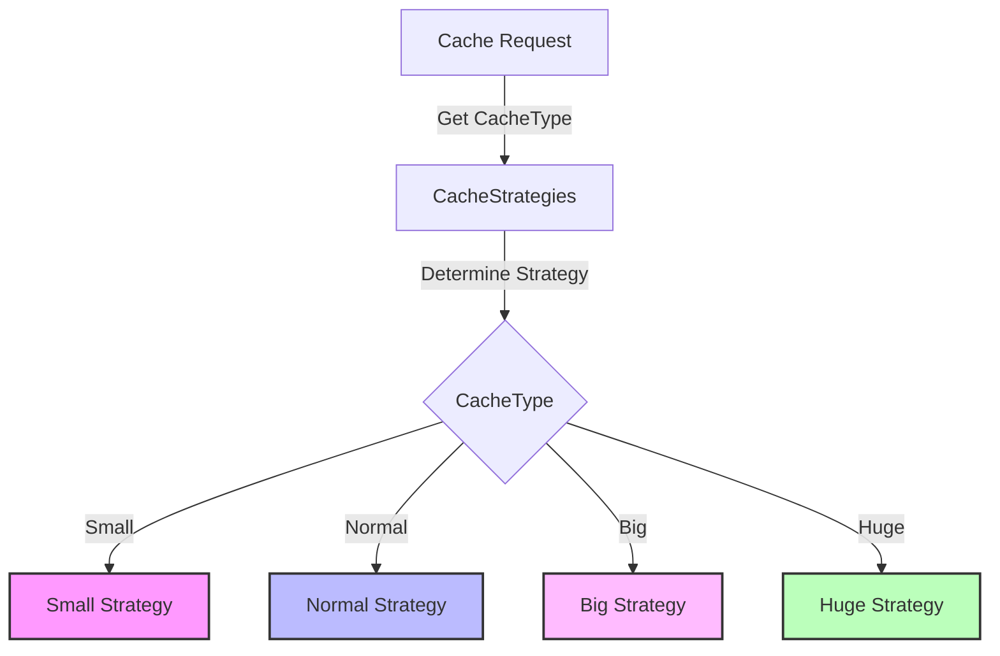

## Module: CacheStrategies.java
- **模块名称**：CacheStrategies.java

- **主要目标**：定义不同缓存策略，以优化数据访问性能和管理缓存大小。

- **关键功能**：
  - `getCacheStrategy(CacheType dbName)`: 根据数据库名称选择合适的缓存策略。

- **关键变量**：
  - `PATTERNS`: 缓存配置的模式字符串。
  - `CACHE_BIG_DBS`, `CACHE_SMALL_DBS`, `CACHE_NORMAL_DBS`, `CACHE_HUGE_DBS`: 分别存储不同大小数据库的缓存类型列表。
  - `CACHE_STRATEGY_DEFAULT`, `CACHE_STRATEGY_SMALL_DEFAULT`, `CACHE_STRATEGY_NORMAL_DEFAULT`, `CACHE_STRATEGY_BIG_DEFAULT`, `CACHE_STRATEGY_HUGE_DEFAULT`: 不同大小数据库的默认缓存策略。

- **互相依赖**：该模块依赖于`CacheType`枚举，用于标识不同的数据库类型。

- **核心 vs. 辅助操作**：
  - 核心操作：选择合适的缓存策略。
  - 辅助操作：定义缓存策略的参数模式。

- **操作序列**：当需要为特定数据库类型配置缓存时，`getCacheStrategy`方法会根据数据库的类型（大小）来选择合适的缓存策略。

- **性能方面**：通过为不同大小的数据库配置合适的缓存策略，可以优化缓存的性能和管理效率。

- **可重用性**：这个模块的设计允许它在不同的数据库和应用场景中重用，只需调整缓存策略的配置即可。

- **使用**：在需要缓存数据库查询结果时，可以使用`CacheStrategies`模块来选择最合适的缓存策略，以提高性能和数据访问速度。

- **假设**：
  - 假设系统环境具有可预测的数据库访问模式，以便为每种类型的数据库选择最合适的缓存策略。
  - 假设系统的CPU数量可以作为配置缓存策略的参考。
## Flow Diagram [via mermaid]

