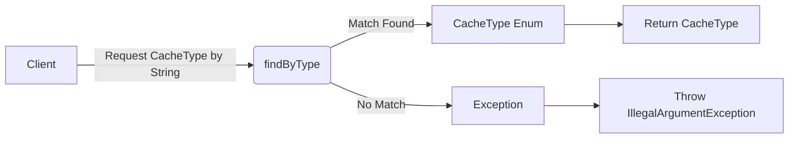

## Module: CacheType.java
模块名称：CacheType.java

**主要目标**：这个模块的目的是定义一个枚举类型`CacheType`，用于标识不同类型的缓存数据。它为系统中的数据缓存提供了一个清晰的分类，以便更有效地管理和访问缓存数据。

**关键函数**：
- `findByType(String type)`：根据提供的类型字符串查找对应的`CacheType`枚举实例。如果找不到匹配项，将抛出`IllegalArgumentException`异常。

**关键变量**：
- `type`：一个字符串，表示缓存类型的唯一标识。这是枚举实例的主要属性。

**相互依赖性**：虽然这个模块本身主要定义了缓存类型，但它与系统中负责缓存管理的其他组件紧密相关。例如，使用`CacheType`来指定某个特定操作或查询所涉及的缓存类型。

**核心与辅助操作**：
- 核心操作包括定义缓存类型和通过类型查找缓存类型枚举实例。
- 辅助操作包括将缓存类型转换为字符串表示（`toString`方法）。

**操作序列**：这个模块主要是定义和查找枚举实例，没有特定的操作序列。

**性能方面**：性能考虑主要集中在`findByType`方法上，该方法需要高效地从预定义的枚举实例中查找匹配项。使用了Java 8的流和lambda表达式来实现快速查找。

**可重用性**：`CacheType`枚举的设计使其具有很高的可重用性，可以在需要管理不同缓存类型的任何地方使用。

**使用**：在需要对缓存进行操作或管理时，通过指定`CacheType`来明确操作的目标缓存类型，从而使缓存管理更加有序和高效。

**假设**：
- 假设所有缓存类型都已经在`CacheType`枚举中定义，不需要动态添加新的缓存类型。
- 假设调用`findByType`方法的用户会处理`IllegalArgumentException`，以应对未找到匹配缓存类型的情况。
## Flow Diagram [via mermaid]

