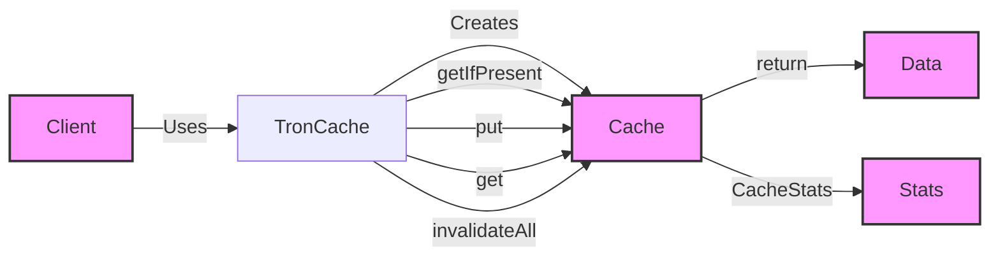

## Module: TronCache.java
模块名称：TronCache.java

**主要目标**：TronCache的目的是提供一个灵活的缓存机制，用于存储和检索键值对数据。它利用Google Guava Cache库来实现缓存功能，支持自定义的缓存策略和数据加载方式。

**关键功能**：
- `put(K k, V v)`: 将键值对存储到缓存中。
- `getIfPresent(K k)`: 如果键存在于缓存中，则返回其值。
- `get(K k, Callable<? extends V> loader)`: 根据提供的键获取值，如果键不存在，则使用Callable参数提供的加载器加载新值。
- `invalidateAll()`: 清除缓存中的所有条目。
- `stats()`: 提供缓存的统计信息，如命中率、加载新值的平均时间等。

**关键变量**：
- `CacheType name`: 缓存的名称，标识不同的缓存实例。
- `Cache<K, V> cache`: Guava Cache实例，负责实际的数据存储和管理。

**相互依赖性**：TronCache依赖于Google Guava的Cache组件来实现其核心功能。此外，它可能与系统中负责数据管理和访问的其他组件交互。

**核心与辅助操作**：
- 核心操作包括数据的存储、检索和统计信息的获取。
- 辅助操作包括缓存的无效化和等价性比较（通过重写`equals`和`hashCode`方法）。

**操作序列**：通常，首先通过`put`方法将键值对存入缓存。随后，可以通过`getIfPresent`或`get`方法检索值。`invalidateAll`方法可用于清除缓存中的所有数据。

**性能方面**：性能考虑包括缓存的命中率、加载新值的时间和缓存的大小管理。通过配置CacheBuilder策略，可以优化这些性能指标。

**可重用性**：TronCache设计为可重用的组件，可以通过不同的`CacheType`和缓存策略来创建多个缓存实例，适应不同的使用场景。

**使用**：TronCache可以被用于减少对底层数据源（如数据库或远程服务）的访问次数，通过缓存常用数据来提高应用性能。

**假设**：假设用户对缓存的大小、过期策略和加载机制有适当的理解，以便能够配置出适合自己需求的缓存策略。此外，还假设缓存的键和值类型是合适的，以便于高效的缓存和检索。
## Flow Diagram [via mermaid]

