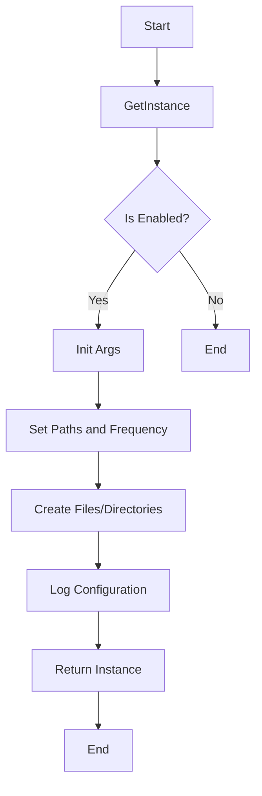

## Module: DbBackupConfig.java
- **模块名称**：DbBackupConfig.java

- **主要目标**：此模块的目的是提供一个数据库备份配置的功能，允许用户配置数据库备份的路径、频率以及是否启用备份功能。

- **关键功能**：
  - `getInstance()`：获取DbBackupConfig的单例实例。
  - `initArgs(boolean enable, String propPath, String bak1path, String bak2path, int frequency)`：初始化数据库备份配置参数，包括是否启用备份、配置文件路径、两个备份路径和备份频率。

- **关键变量**：
  - `instance`：DbBackupConfig的单例实例。
  - `propPath`：配置文件路径。
  - `bak1path`、`bak2path`：备份路径。
  - `frequency`：备份频率。
  - `enable`：是否启用备份功能。

- **依赖性**：此模块依赖于`FileUtil`类来创建文件和目录，确保备份路径有效。

- **核心与辅助操作**：
  - 核心操作：备份数据库的配置和初始化。
  - 辅助操作：创建文件和目录，日志记录。

- **操作顺序**：首先检查是否启用备份，然后验证和处理备份路径，接着创建必要的文件和目录，最后记录配置成功的信息。

- **性能方面**：性能考虑主要集中在文件操作上，确保路径的有效性和避免创建不必要的文件或目录。

- **可重用性**：此模块设计为单例模式，易于在多处重用，只需通过`getInstance()`方法访问实例并通过`initArgs`方法配置。

- **使用**：在需要数据库备份功能的场景下使用，通过提供备份路径、频率和启用标志来配置。

- **假设**：
  - 用户提供的备份路径是有效的，且两个备份路径不相同。
  - 备份频率是一个正数。
  - 用户有足够的权限创建文件和目录。

通过这个模块，用户可以灵活地配置数据库备份，包括备份的频率和位置，以及是否启用此功能。这有助于增强数据的安全性和恢复能力。
## Flow Diagram [via mermaid]

