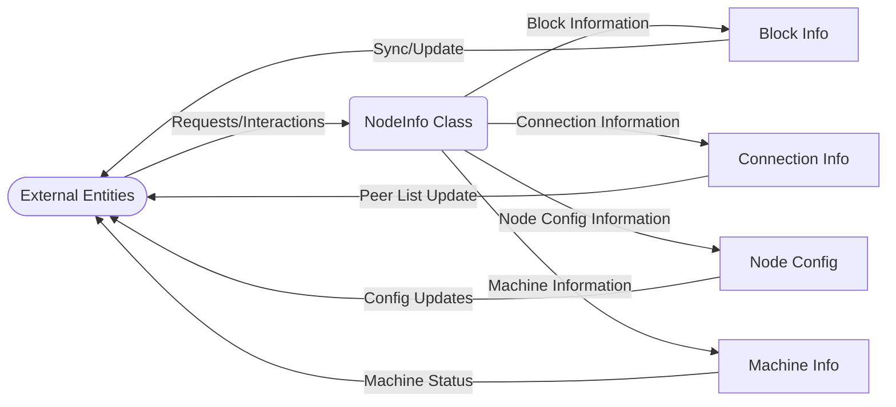

## Module: NodeInfo.java
**模块名称**：NodeInfo.java

**主要目标**：该模块的目的是定义和管理节点信息，包括区块信息、连接信息、节点配置信息和机器信息。

**关键功能**：
- **获取和设置同步开始的区块号**（`getBeginSyncNum`, `setBeginSyncNum`）：管理同步开始时的区块号。
- **获取和设置区块信息**（`getBlock`, `setBlock`）：管理当前节点的区块信息。
- **获取和设置连接信息**（`getCurrentConnectCount`, `setActiveConnectCount`等）：管理节点的当前连接数、主动连接数和被动连接数。
- **获取和设置节点配置信息**（`getConfigNodeInfo`, `setConfigNodeInfo`）：管理节点的配置信息，如版本号、P2P版本等。
- **获取和设置机器信息**（`getMachineInfo`, `setMachineInfo`）：管理节点运行的机器信息，如CPU使用率、内存信息等。

**关键变量**：
- `beginSyncNum`：同步开始的区块号。
- `block`、`solidityBlock`：区块信息。
- `currentConnectCount`、`activeConnectCount`、`passiveConnectCount`：连接信息。
- `totalFlow`：总流量。
- `peerList`：对等节点列表。
- `configNodeInfo`：节点配置信息。
- `machineInfo`：机器信息。
- `cheatWitnessInfoMap`：作弊见证人信息映射。

**依赖性**：与`org.tron.protos.Protocol`中的协议实体进行交互，将节点信息转换为协议实体。

**核心与辅助操作**：
- 核心操作包括管理节点的基本信息（如区块信息、连接数）和机器信息。
- 辅助操作包括设置和获取各种信息的具体方法。

**操作序列**：首先设置节点的基本信息（如同步区块号、连接信息等），然后可以根据需要获取这些信息。

**性能方面**：性能考虑可能包括如何高效地管理和更新节点信息，以及如何优化内存和CPU的使用。

**可重用性**：该模块设计为可重用，可以在需要管理节点信息的不同场景中使用。

**使用**：在需要管理和维护区块链节点信息的应用中使用，如在区块链网络中监控和配置节点。

**假设**：
- 假设节点运行在支持Java的机器上。
- 假设所有设置的值都是有效的，没有进行额外的验证。

这个分析提供了对`NodeInfo.java`模块功能和结构的全面概述，包括它如何与系统的其他部分交互，以及其设计和实现的关键方面。
## Flow Diagram [via mermaid]

