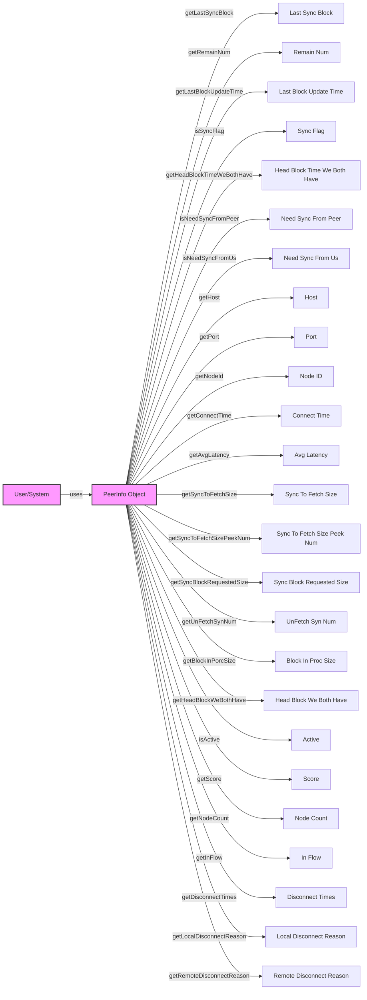

## Module: PeerInfo.java
- **模块名称**：PeerInfo.java

- **主要目的**：此模块的目的是定义一个表示同行节点信息的实体类，用于管理和存储同行节点的相关数据。

- **关键函数**：
  - `setLastSyncBlock`、`getLastSyncBlock`：设置和获取最后同步的区块信息。
  - `setRemainNum`、`getRemainNum`：设置和获取剩余的区块数量。
  - `setLastBlockUpdateTime`、`getLastBlockUpdateTime`：设置和获取最后一个区块更新的时间。
  - `setSyncFlag`、`isSyncFlag`：设置和获取同步标志。
  - `setHeadBlockTimeWeBothHave`、`getHeadBlockTimeWeBothHave`：设置和获取双方都有的头块时间。
  - `setNeedSyncFromPeer`、`isNeedSyncFromPeer`：设置和获取是否需要从同行节点同步。
  - `setNeedSyncFromUs`、`isNeedSyncFromUs`：设置和获取是否需要向同行节点同步。
  - `setHost`、`getHost`：设置和获取主机地址。
  - `setPort`、`getPort`：设置和获取端口号。
  - `setNodeId`、`getNodeId`：设置和获取节点ID。
  - `setConnectTime`、`getConnectTime`：设置和获取连接时间。
  - `setAvgLatency`、`getAvgLatency`：设置和获取平均延迟。
  - `setActive`、`isActive`：设置和获取活动状态。
  - `setScore`、`getScore`：设置和获取评分。
  - `setNodeCount`、`getNodeCount`：设置和获取节点计数。

- **关键变量**：`lastSyncBlock`、`remainNum`、`lastBlockUpdateTime`、`syncFlag`、`headBlockTimeWeBothHave`、`needSyncFromPeer`、`needSyncFromUs`、`host`、`port`、`nodeId`、`connectTime`、`avgLatency`、`isActive`、`score`、`nodeCount`。

- **互依赖性**：此类主要独立使用，但它可能会与网络通信、数据库存储或日志记录等系统组件交互，用于同步和更新节点信息。

- **核心与辅助操作**：核心操作包括节点信息的设置和获取，如同步状态、连接信息等。辅助操作可能包括评分和活动状态的更新。

- **操作序列**：通常，首先通过构造函数或者初始化方法创建实例，然后根据需要调用相应的设置函数来更新节点信息，最后可以通过获取函数来访问这些信息。

- **性能方面**：此类的性能主要取决于它如何被使用，包括频繁度和上下文（例如，在高频更新场景中可能需要优化）。

- **可重用性**：PeerInfo类设计为通用的同行节点信息表示，可以在不同的网络通信场景中重用。

- **使用**：此类用于在节点间的通信过程中管理和交换节点状态信息，如在区块链网络中的节点同步。

- **假设**：假设所有节点之间的通信是安全的，且节点信息在传输过程中不会被篡改。此外，还假设节点间的时间同步。
## Flow Diagram [via mermaid]

