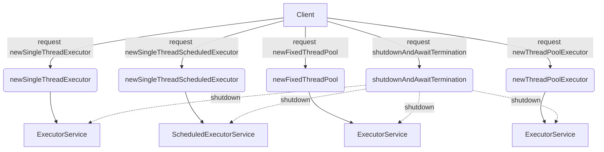

## Module: ExecutorServiceManager.java
**模块名称**：ExecutorServiceManager.java

**主要目标**：此模块的目的是提供一种简便方法来创建和管理不同类型的线程池，包括单线程执行器、固定大小的线程池和可调度的线程池。它旨在简化Java并发包(java.util.concurrent)的使用，使得线程池的创建和管理更加直接和高效。

**关键函数**：
- `newSingleThreadExecutor`：创建一个单线程的ExecutorService。
- `newSingleThreadScheduledExecutor`：创建一个单线程的ScheduledExecutorService，用于执行定时任务。
- `newFixedThreadPool`：创建一个固定大小的线程池。
- `newThreadPoolExecutor`：提供了更多自定义选项的线程池创建方法，包括核心线程数、最大线程数、存活时间等。
- `shutdownAndAwaitTermination`：关闭线程池并等待已提交的任务完成。

**关键变量**：无明显的关键变量，因为这是一个主要提供静态方法的工具类。

**相互依赖性**：此模块依赖于Java的并发包中的类，如ExecutorService、ScheduledExecutorService和ThreadPoolExecutor，以及Google的Guava库中的ThreadFactoryBuilder来自定义线程工厂。

**核心与辅助操作**：创建和管理线程池的方法是核心操作；`shutdownAndAwaitTermination`方法是辅助操作，用于优雅地关闭线程池。

**操作序列**：通常，用户首先会调用相应的方法创建一个线程池，然后向该线程池提交任务执行。在不再需要线程池时，用户会调用`shutdownAndAwaitTermination`方法来关闭线程池。

**性能方面**：通过合理配置核心线程数、最大线程数和存活时间等参数，可以优化线程池的性能。使用守护线程(daemon threads)可以避免阻止应用程序的正常退出。

**可重用性**：此模块设计为高度可重用，提供了多种创建线程池的方法，可以根据不同的需求进行选择和定制。

**使用**：此模块可用于需要并发执行任务的任何Java应用程序中，尤其适合需要管理多个线程池的场景。

**假设**：
- 用户熟悉Java并发编程的基本概念。
- 用户需要根据自己的应用程序需求来配置线程池的参数。
## Flow Diagram [via mermaid]

