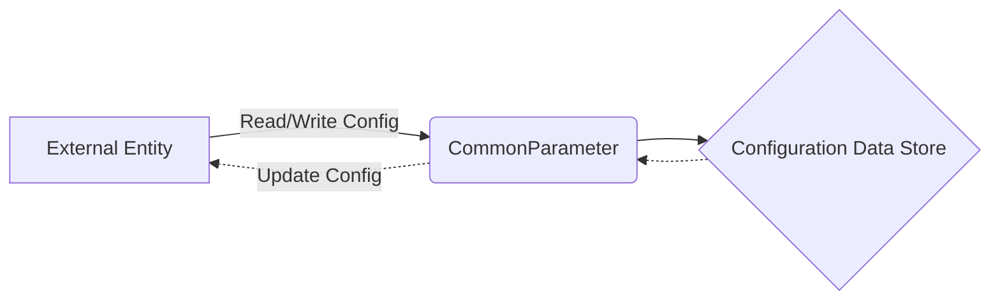

## Module: CommonParameter.java
由于提供的代码模块比较长，我将基于这个模块提供一个概要的分析。

- **模块名称**：CommonParameter.java

- **主要目的**：该模块的主要目的是定义和管理Java Tron应用程序的配置参数。这些参数可以通过命令行或配置文件进行设置，用于控制节点的行为和功能。

- **关键功能**：
  - 参数定义和获取：通过注解`@Parameter`定义了多个配置参数，如配置文件路径、数据库目录、日志配置等，并提供了相应的getter和setter方法。
  - 参数实例化：提供了`PARAMETER`静态实例和`getInstance()`方法，实现单例模式，确保全局只有一个参数实例。
  - 动态参数调整：部分参数支持在运行时调整，如`maxEnergyLimitForConstant`、`lruCacheSize`等。

- **关键变量**：
  - `PARAMETER`：静态实例，用于访问和管理配置参数。
  - `shellConfFileName`、`outputDirectory`、`logbackPath`等：用于配置文件路径、数据目录、日志配置的参数。

- **依赖关系**：该模块与系统的其他组件（如数据库设置、P2P配置、事件插件配置等）有较强的关联性，通过配置参数影响这些组件的行为。

- **核心与辅助操作**：
  - 核心操作：参数的定义、获取和设置。
  - 辅助操作：提供了一些辅助方法，如`calcMaxTimeRatio()`、`isECKeyCryptoEngine()`，用于计算或判断配置状态。

- **操作顺序**：首先通过命令行参数或配置文件设置参数值，然后在应用程序启动时读取这些参数，最后在运行时根据这些参数控制应用程序的行为。

- **性能方面**：通过参数配置，可以调整应用程序的性能，如设置LRU缓存大小、能量限制等。

- **可重用性**：该模块高度可配置，通过改变参数值可以轻松适应不同的运行环境和需求，具有很好的可重用性。

- **使用方式**：在应用程序启动时，通过命令行参数或配置文件来设置这些参数。开发者可以根据需要修改默认值或添加新的配置项。

- **假设**：
  - 假设用户熟悉Java Tron的运行环境和配置需求。
  - 假设在应用程序的不同运行阶段，部分参数可能需要根据实际情况进行调整。

这个分析提供了对`CommonParameter.java`模块的高级概览，详细的实现和配置项需要参考具体的代码和文档。
## Flow Diagram [via mermaid]

