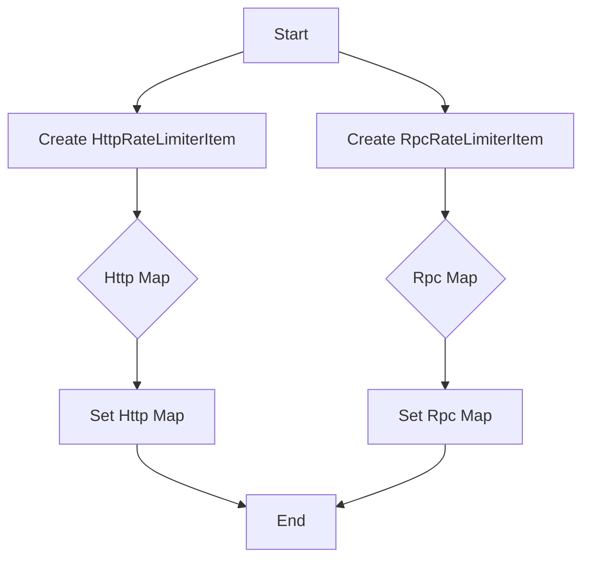

## Module: RateLimiterInitialization.java
- **模块名称**：RateLimiterInitialization.java

- **主要目标**：该模块的目的是初始化和配置HTTP和RPC请求的速率限制器，确保系统能够处理请求而不会超出预定的处理能力。

- **关键函数**：
  - `createHttpItem(ConfigObject asset)`：根据配置创建HTTP速率限制项。
  - `createRpcItem(ConfigObject asset)`：根据配置创建RPC速率限制项。
  - `setHttpMap(List<HttpRateLimiterItem> list)`：设置HTTP速率限制项映射。
  - `setRpcMap(List<RpcRateLimiterItem> list)`：设置RPC速率限制项映射。

- **关键变量**：
  - `httpMap`：存储HTTP速率限制项的映射。
  - `rpcMap`：存储RPC速率限制项的映射。
  - `httpFlag`：指示是否有HTTP限制项被设置。
  - `rpcFlag`：指示是否有RPC限制项被设置。

- **相互依赖性**：该模块依赖于外部配置（通过`ConfigObject`传入），用于初始化速率限制项。此外，它可能与实际执行HTTP和RPC请求的其他系统组件交互，以确保遵守速率限制。

- **核心与辅助操作**：
  - 核心操作包括创建速率限制项（`createHttpItem`和`createRpcItem`）以及设置映射（`setHttpMap`和`setRpcMap`）。
  - 辅助操作可能包括读取配置和处理异常。

- **操作序列**：首先，从配置中读取速率限制项；然后，使用这些项初始化`httpMap`和`rpcMap`；最后，根据这些映射设置`httpFlag`和`rpcFlag`，以指示是否已配置相应的限制。

- **性能方面**：需要注意的性能考虑包括确保速率限制配置不会导致不必要的性能瓶颈，特别是在高并发场景下。

- **可重用性**：该模块通过提供灵活的配置选项（如不同的限制策略和参数）来支持重用，可以根据不同的应用场景调整速率限制设置。

- **使用**：该模块被用于初始化系统的速率限制设置，通常在系统启动时或需要动态调整速率限制策略时使用。

- **假设**：该模块假设提供的配置是有效的，并且存在适当的错误处理机制来处理无效或不完整的配置项。此外，还假设系统的其他部分将遵守这些速率限制设置。
## Flow Diagram [via mermaid]

