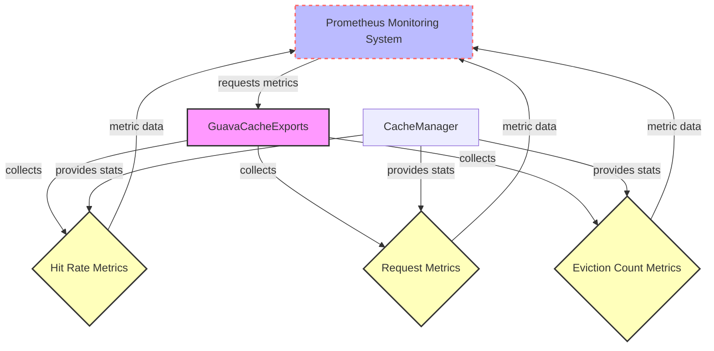

## Module: GuavaCacheExports.java
- **模块名称**: GuavaCacheExports.java

- **主要目标**: 该模块的目的是导出关于Guava缓存的指标到Prometheus，以便进行监控和分析。

- **关键功能**:
  - `addHitRateMetrics`: 添加缓存命中率指标。
  - `addRequestMetrics`: 添加缓存请求量指标。
  - `addEvictionCountMetrics`: 添加缓存驱逐计数指标。
  - `collect`: 收集所有指标数据。

- **关键变量**:
  - `TRON_GUAVA_CACHE_HIT_RATE`: 缓存命中率指标名。
  - `TRON_GUAVA_CACHE_REQUEST`: 缓存请求量指标名。
  - `TRON_GUAVA_CACHE_EVICTION_COUNT`: 缓存驱逐计数指标名。

- **依赖关系**: 该模块依赖于`CacheManager`来获取缓存的统计信息，并依赖于Prometheus客户端库来导出指标。

- **核心与辅助操作**:
  - 核心操作包括`addHitRateMetrics`、`addRequestMetrics`和`addEvictionCountMetrics`方法，它们负责生成具体的缓存性能指标。
  - 辅助操作包括`collect`方法，它负责组织和返回所有指标数据。

- **操作序列**: 当`collect`方法被调用时，它会依次调用`addHitRateMetrics`、`addRequestMetrics`和`addEvictionCountMetrics`方法来收集指标数据，最后返回这些数据。

- **性能方面**: 在性能方面，该模块需要高效地从`CacheManager`中获取统计信息，并且能够快速地生成和导出指标数据，以最小化对系统性能的影响。

- **可重用性**: 该模块设计为可重用的，可以轻松地集成到需要监控Guava缓存性能的任何Java应用中。

- **使用方式**: 使用示例代码中所示，通过创建`GuavaCacheExports`实例并调用其`register`方法，可以将该模块集成到应用中，并开始导出缓存指标。

- **假设**: 该模块假设`CacheManager`能够提供关于Guava缓存的全面统计信息，包括命中率、请求量和驱逐计数等。
## Flow Diagram [via mermaid]

