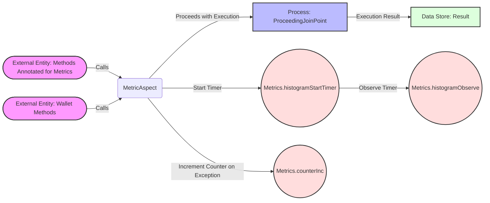

## Module: MetricAspect.java
- **模块名称**：MetricAspect.java

- **主要目标**：该模块的目的是为了提供一个面向切面的编程(AOP)功能，用于监控和记录应用中各个方法的执行时间和失败次数，以此来帮助分析应用的性能和稳定性。

- **关键函数**：
  - `aroundAdviceMetricTime(ProceedingJoinPoint pjp, MetricTime metricTime)`：该方法围绕被`@MetricTime`注解标记的方法执行，用于开始一个计时器，执行目标方法，并在执行后记录执行时间。
  - `walletAroundAdvice(ProceedingJoinPoint pjp)`：该方法围绕`org.tron.core.Wallet`中的公共方法执行，具体用途与`aroundAdviceMetricTime`相同，但专门针对钱包操作。

- **关键变量**：
  - `Histogram.Timer requestTimer`：用于记录方法执行的时间。
  
- **相互依赖性**：该模块依赖于`io.prometheus.client.Histogram`类来创建和管理计时器，同时依赖于`org.aspectj.lang`包中的类来实现AOP功能。

- **核心与辅助操作**：
  - 核心操作包括方法执行的监控和计时器的管理。
  - 辅助操作包括异常捕获和计数器的增加，用于记录失败的操作。

- **操作序列**：首先，通过AOP在目标方法前启动计时器，然后执行目标方法，最后无论方法成功还是抛出异常，都会记录执行时间，并在出现异常时增加失败计数。

- **性能方面**：通过监控方法执行时间和失败次数，可以帮助开发者识别性能瓶颈和不稳定的操作，从而优化应用性能和稳定性。

- **可重用性**：由于该模块是基于AOP实现的，它可以轻松地应用于其他需要监控方法执行时间和失败次数的场景，具有良好的可重用性。

- **使用方式**：在需要监控的方法上使用`@MetricTime`注解，或者通过配置AOP切点来指定需要监控的方法或类。

- **假设**：该模块假设所有需要监控的方法都能够通过AOP切面正确地被捕获，并且Prometheus客户端能够正常工作，用于记录和展示监控数据。
## Flow Diagram [via mermaid]

