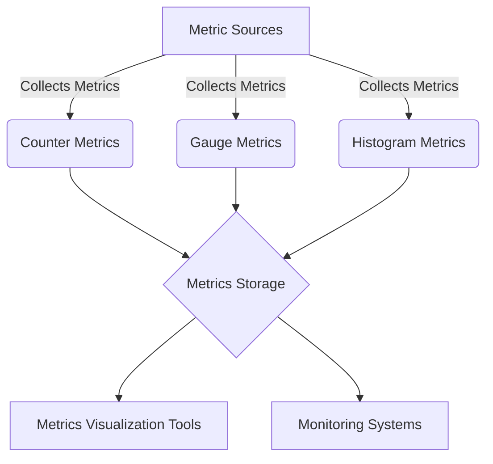

## Module: MetricKeys.java
- **模块名称**：MetricKeys.java

- **主要目标**：该模块的主要目的是定义用于Tron区块链监控的各种指标键值。这些指标键值被用于收集和监控系统的性能数据。

- **关键函数**：
  - **Counter类**：定义了一系列的计数器指标，如交易数(`TXS`)、矿工数(`MINER`)、区块分叉数(`BLOCK_FORK`)等，用于统计事件发生的次数。
  - **Gauge类**：定义了一系列的仪表盘指标，如头部高度(`HEADER_HEIGHT`)、对等节点数(`PEERS`)、数据库大小(`DB_SIZE_BYTES`)等，用于衡量某一时刻的状态值。
  - **Histogram类**：定义了一系列的直方图指标，如HTTP服务延迟(`HTTP_SERVICE_LATENCY`)、GRPC服务延迟(`GRPC_SERVICE_LATENCY`)等，用于记录事件发生的延迟分布情况。

- **关键变量**：在Counter、Gauge和Histogram内部类中定义的静态常量，如`TXS`、`HEADER_HEIGHT`、`HTTP_SERVICE_LATENCY`等，这些都是监控指标的键值。

- **相互依赖性**：该模块主要与系统的监控组件相互依赖，用于提供必要的指标数据，以便于监控系统的性能和状态。

- **核心与辅助操作**：核心操作包括定义和管理各种指标键值，而辅助操作可能包括与其他监控工具或组件的交互，以确保指标数据的准确收集和报告。

- **操作序列**：该模块主要是静态定义的，没有特定的操作序列。其作用是在系统的其他部分被引用，以便于收集和监控指定的指标数据。

- **性能方面**：该模块的性能考虑主要集中在确保指标键值的定义清晰、准确，以便于高效地收集和处理监控数据。

- **可重用性**：由于该模块提供了一系列标准化的监控指标定义，因此具有较高的可重用性，可以在Tron区块链的不同组件或其他类似系统中使用。

- **使用**：在Tron区块链系统的监控和性能分析过程中，通过引用MetricKeys模块中定义的指标键值，来收集和报告系统的运行数据。

- **假设**：该模块的设计和实现基于假设，系统的其他部分会正确地实现和使用这些指标键值，以确保监控数据的准确性和有效性。
## Flow Diagram [via mermaid]

