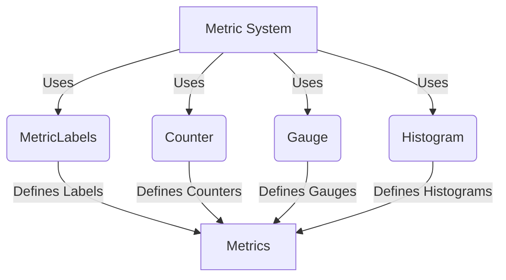

## Module: MetricLabels.java
- **模块名称**: MetricLabels.java

- **主要目标**: 此模块的目的是为了定义和管理用于Prometheus监控的各种指标标签，以便于在系统中统一标识和跟踪成功、失败、各类计数器和度量指标。

- **关键函数**:
  - **Counter类**: 提供了与“挖矿”和交易成功、失败等相关的静态常量标签。
  - **Gauge类**: 定义了队列状态、节点状态等相关的静态常量标签。
  - **Histogram类**: 涉及到流量进出的静态常量标签。

- **关键变量**:
  - 成功、失败、全部、未定义、区块、交易等标签常量。
  - 计数器和度量标签，如挖矿成功、交易失败原因标签等。

- **依赖性**:
  - 该模块主要与系统的监控组件相互作用，尤其是与Prometheus监控系统的集成。

- **核心与辅助操作**:
  - 核心操作包括定义关键的监控标签。
  - 辅助操作可能包括与其他系统组件的交互以获取实际的监控数据。

- **操作顺序**:
  - 由于此模块主要定义静态常量，因此没有特定的操作顺序。

- **性能方面**:
  - 此模块对性能的影响主要体现在如何高效地使用这些标签进行监控数据的分类和汇总。

- **可重用性**:
  - 由于定义了广泛适用的监控标签，这些标签可以在不同的监控场景中重用，提高了模块的可适应性。

- **使用**:
  - 在需要进行系统监控和性能分析时，通过这些预定义的标签来标识和分类不同的监控数据。

- **假设**:
  - 假设系统中的其他部分将使用这些标签来统一报告监控数据。
  - 假设Prometheus或类似的监控系统已经集成到系统中，能够识别和处理这些标签。
## Flow Diagram [via mermaid]

