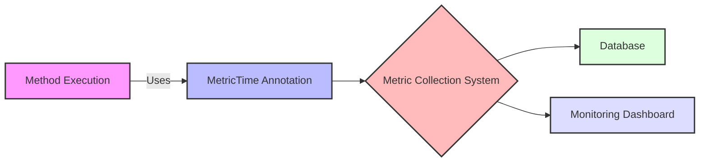

## Module: MetricTime.java
- **模块名称**：MetricTime.java

- **主要目标**：这个模块的目的是为了定义一个注解（Annotation），用于标记方法，以便在执行时进行性能监控或度量。它属于`org.tron.common.prometheus`包，通常用于监控和记录特定方法的执行时间，以便进行性能分析。

- **关键功能**：
  - `value()`：这是MetricTime注解的主要方法。它允许用户指定一个字符串值，通常用于指定监控指标的名称。这个方法是带有默认值的，意味着在使用注解时可以不必显式指定。

- **关键变量**：在这个上下文中，主要的“变量”是注解方法中的`value`属性，它决定了监控指标的命名。

- **依赖关系**：此注解依赖于Java注解处理机制和可能的性能监控框架（如Prometheus）来实际收集和报告标记方法的执行时间。它还可能与项目中用于性能监控的其他组件交互。

- **核心与辅助操作**：核心操作是通过`value`属性提供监控指标的命名。没有明显的辅助操作，因为这是一个相对简单的注解定义。

- **操作序列**：在使用时，首先在方法上应用`@MetricTime`注解，并可选地指定一个指标名称。当应用运行并调用这些被注解的方法时，性能监控系统会自动记录这些方法的执行时间。

- **性能方面**：使用这种注解可能会引入微小的性能开销，因为它涉及到在方法执行前后记录时间。然而，这通常是可忽略的，特别是考虑到获得的性能监控信息的价值。

- **可重用性**：这个注解高度可重用，可以应用于任何需要监控执行时间的方法上。它的设计简单且通用，易于在不同项目中复用。

- **使用**：开发者可以通过将此注解添加到想要监控的方法上，来使用它。这允许性能监控工具自动捕捉这些方法的执行时间，而无需修改方法本身的代码。

- **假设**：使用这个注解的主要假设是存在一个外部系统或框架（如Prometheus），能够识别这个注解并据此收集方法执行时间的数据。此外，还假设这种监控不会对应用的性能产生显著影响。
## Flow Diagram [via mermaid]

