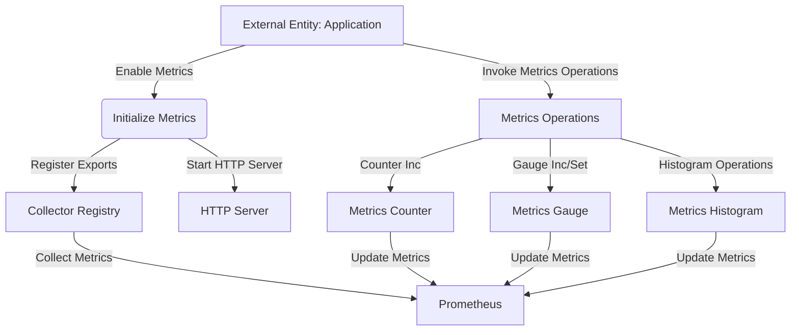

## Module: Metrics.java
**模块名称**：Metrics.java

**主要目标**：该模块的目的是为了集成Prometheus监控，提供一种方式来监控和记录应用程序的运行指标，以便于进行性能分析和问题定位。

**关键函数**：
- `init()`：初始化Prometheus监控，包括启动HTTP服务器以暴露指标数据。
- `counterInc(String key, double amt, String... labels)`：增加计数器的值。
- `gaugeInc(String key, double amt, String... labels)`：增加仪表的值。
- `gaugeSet(String key, double amt, String... labels)`：设置仪表的值。
- `histogramStartTimer(String key, String... labels)`：开始一个直方图计时器。
- `histogramObserve(Histogram.Timer startTimer)` 和 `histogramObserve(String key, double amt, String... labels)`：观察并记录直方图的值。

**关键变量**：
- `MILLISECONDS_PER_SECOND`：用于时间单位转换。
- `initialized`：标识监控是否已经初始化。

**互依赖性**：该模块依赖于Prometheus客户端库来收集和导出监控数据，同时也依赖于项目内的`CommonParameter`类来获取配置信息。

**核心与辅助操作**：核心操作包括监控的初始化和数据的收集（如计数器、仪表和直方图的操作）。辅助操作包括配置检查和日志记录。

**操作序列**：首先检查监控是否已经被初始化，如果未初始化则根据配置启动HTTP服务器并注册默认的监控项，然后标记为已初始化。

**性能方面**：该模块需要考虑到监控数据收集和导出的性能开销，尤其是在高并发环境下对性能的影响。

**可重用性**：该模块设计成静态方法集合，方便在应用程序的不同部分被重用来记录不同的监控指标。

**使用**：在需要监控的应用程序中，通过调用`Metrics`类的方法来记录各种类型的指标数据。

**假设**：假设用户已经有了Prometheus的基础知识，并且在应用程序的环境中Prometheus监控是被允许的。此外，还假设`CommonParameter`类提供的配置信息是准确和可靠的。
## Flow Diagram [via mermaid]

