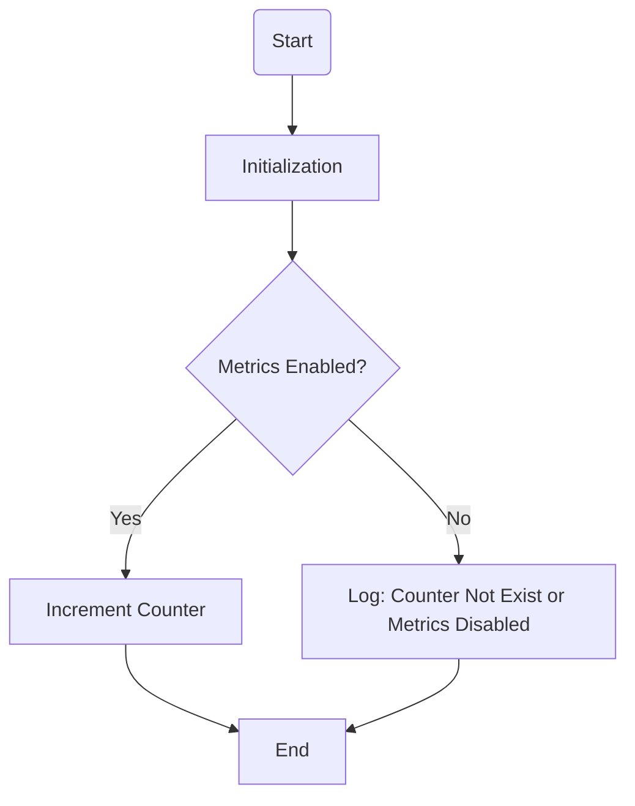

## Module: MetricsCounter.java
- **模块名称**：MetricsCounter.java

- **主要目标**：此模块的目的是为了在Tron项目中提供一个统一的指标计数器，用于监控和统计各种操作的频率，例如交易、挖矿、区块分叉、P2P错误和断开连接等事件。

- **关键功能**：
  - `init`：初始化指定名称的计数器，包括其帮助信息和标签。
  - `inc`：根据指定的键和标签增加计数器的值。

- **关键变量**：
  - `container`：一个线程安全的HashMap，用于存储不同指标的计数器对象。

- **相互依赖性**：此模块依赖于`io.prometheus.client.Counter`来创建和管理指标计数器。它还可能与系统的其他部分交互，以提供实时的监控数据。

- **核心与辅助操作**：
  - 核心操作包括初始化计数器(`init`)和增加计数器值(`inc`)。
  - 辅助操作可能包括日志记录，以及与Prometheus监控系统的集成。

- **操作序列**：首先通过`init`方法初始化计数器，然后在适当的时候通过`inc`方法增加计数器的值。

- **性能方面**：使用`ConcurrentHashMap`确保了在多线程环境下对计数器的高效访问。性能考量还包括确保计数器更新的原子性和减少同步开销。

- **可重用性**：这个模块设计得很通用，可以轻松地适用于其他需要监控和统计指标的系统，只需简单的配置即可。

- **使用**：在需要监控特定事件（如交易、挖矿操作等）的频率时，通过`MetricsCounter`模块提供的接口来增加相应的计数器值。

- **假设**：
  - 假设`Metrics.enabled()`返回`true`，表示监控功能是启用的，这时才会进行计数器的增加操作。
  - 假设所有需要监控的事件都能够通过已定义的计数器进行准确的统计。

通过以上分析，我们可以看到`MetricsCounter`模块在Tron项目中扮演着重要的角色，它提供了一个高效、线程安全的方式来监控系统的关键性能指标。
## Flow Diagram [via mermaid]

