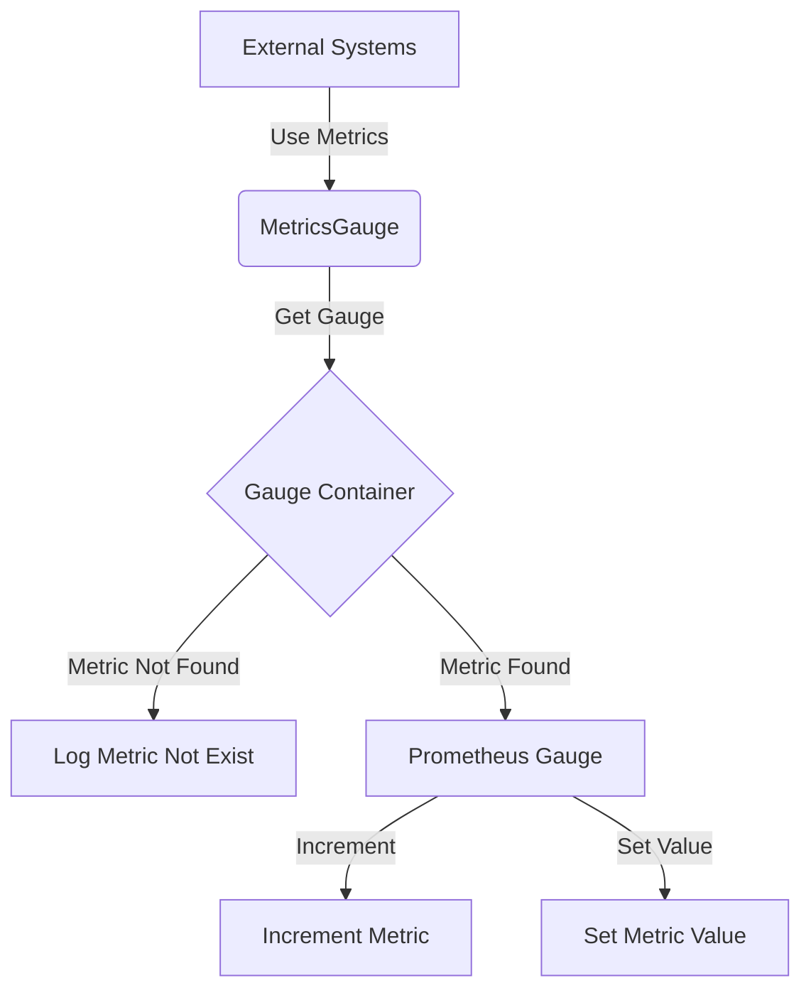

## Module: MetricsGauge.java
- **模块名称**：MetricsGauge.java

- **主要目标**：该模块的目的是为了在Java应用中管理和报告各种指标（metrics），特别是针对Prometheus指标的管理。

- **关键功能**：
  - `init`：初始化指标，包括指标的名称、帮助信息和标签。
  - `inc`：增加指定指标的值。
  - `set`：设置指定指标的值。

- **关键变量**：
  - `container`：一个存储所有Gauge指标的容器，使用ConcurrentHashMap来保证线程安全。

- **相互依赖性**：该模块依赖于`io.prometheus.client.Gauge`类来创建和管理Prometheus的Gauge指标。

- **核心与辅助操作**：
  - 核心操作包括指标的初始化、值的增加和设置。
  - 辅助操作可能包括日志记录等，用于辅助调试和监控。

- **操作顺序**：首先通过`init`方法初始化指标，然后可以通过`inc`或`set`方法修改指标的值。

- **性能方面**：使用ConcurrentHashMap来存储指标，以提供线程安全的访问，这对于多线程环境中的性能是重要的。

- **可重用性**：该模块设计为可重用的，可以在需要管理Prometheus指标的任何Java应用中使用。

- **使用**：在需要收集和报告Prometheus指标的Java应用中使用该模块，通过提供的方法来创建、更新指标值。

- **假设**：
  - 假设`Metrics.enabled()`方法用于检查指标是否启用。
  - 假设Prometheus环境已经设置，且应用有权限创建和修改指标。
## Flow Diagram [via mermaid]

