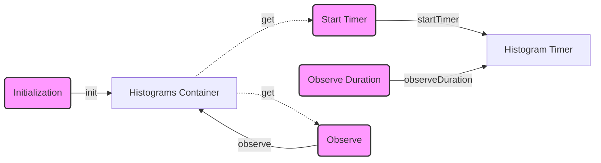

## Module: MetricsHistogram.java
**模块名称**：MetricsHistogram.java

**主要目标**：此模块的目的是为了提供一个统一的接口来收集和报告各种指标的直方图数据，如服务延迟、流量等，以便于监控和性能分析。

**关键功能**：
- **init**：初始化直方图指标，包括指标名称、帮助信息和标签。
- **startTimer**：根据指定的键和标签开始一个计时器，用于测量操作的延迟。
- **observeDuration**：停止计时器并记录操作的持续时间。
- **observe**：直接记录一个给定量的观测值。

**关键变量**：
- **container**：一个线程安全的HashMap，用于存储所有的直方图对象。

**交互依赖**：
- 与`Metrics`类交互，确保只有在指标功能启用时才进行数据的收集和报告。

**核心与辅助操作**：
- 核心操作包括初始化直方图、开始计时和记录观测值。
- 辅助操作包括检查指标是否启用和记录日志信息。

**操作顺序**：
1. 初始化直方图指标。
2. 当需要测量某个操作的延迟时，调用`startTimer`开始计时。
3. 操作完成后，调用`observeDuration`停止计时并记录持续时间。
4. 对于直接的观测值，使用`observe`方法记录。

**性能考虑**：
- 使用`ConcurrentHashMap`来存储直方图对象，以支持多线程环境下的安全操作。
- 通过延迟测量和记录，有助于减少性能开销，同时提供详细的性能指标。

**可重用性**：
- 此模块设计为通用的直方图收集工具，可以适应不同的监控需求和场景。

**使用**：
- 在需要监控和分析的服务或操作中，通过调用相应的方法来开始计时、记录持续时间或直接的观测值。

**假设**：
- 假设`Metrics`类负责全局的指标功能开关控制。
- 假设所有的监控指标都需要通过直方图的方式进行收集和报告。

通过这种方式，`MetricsHistogram`模块为系统提供了一个强大的性能监控和分析工具，能够帮助开发者和运维人员更好地理解和优化系统的运行状况。
## Flow Diagram [via mermaid]

