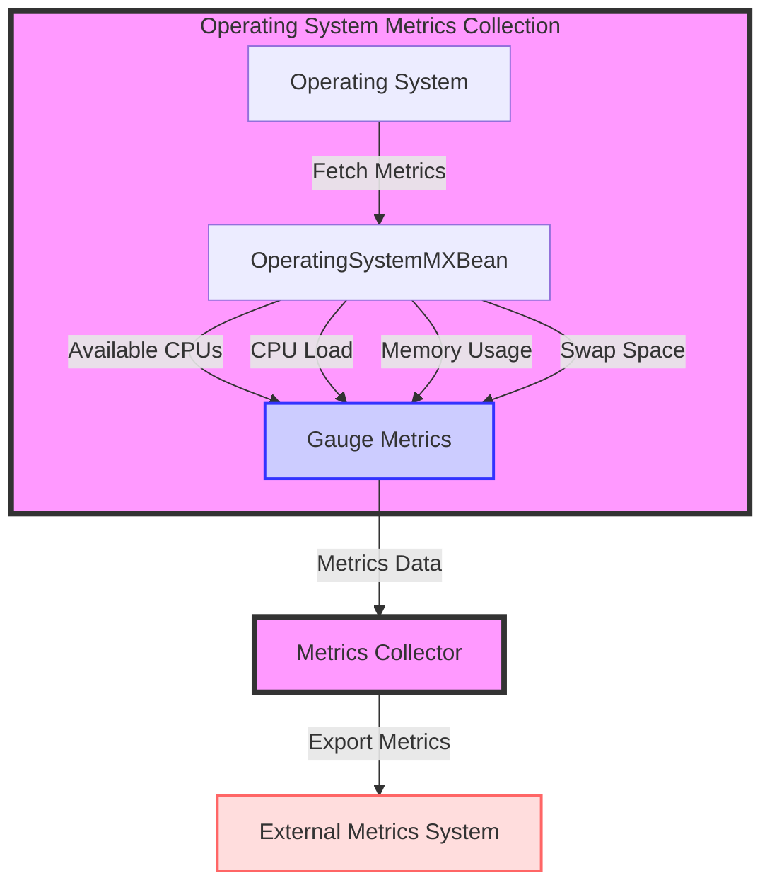

## Module: OperatingSystemExports.java
- **模块名称**：OperatingSystemExports.java

- **主要目标**：此模块的目的是导出有关操作系统的指标，以便在Prometheus监控系统中使用。

- **关键功能**：
  - `addOperatingSystemMetrics`：根据提供的过滤器向指标家族列表中添加操作系统相关的指标。
  - `collect`：收集所有或特定的操作系统指标，返回一个指标家族样本列表。

- **关键变量**：
  - `operatingSystemMXBean`：用于获取操作系统的各种指标。
  - 各种指标名如`SYSTEM_AVAILABLE_CPUS`、`PROCESS_CPU_LOAD`等，代表可用的CPU数、进程CPU负载等。

- **相互依赖性**：此模块依赖于Java的`OperatingSystemMXBean`来获取系统指标，并依赖于Prometheus客户端库来格式化和导出这些指标。

- **核心与辅助操作**：
  - 核心操作包括获取操作系统指标并将其格式化为Prometheus兼容的格式。
  - 辅助操作可能包括过滤特定的指标以供导出。

- **操作顺序**：首先初始化`OperatingSystemMXBean`，然后根据需要调用`collect`方法来收集和返回所有或过滤后的指标。

- **性能方面**：性能考虑可能包括确保指标收集过程不会对系统性能产生显著影响，特别是在高负载条件下。

- **可重用性**：此模块设计为可重用，可以轻松集成到需要操作系统指标的任何Prometheus监控设置中。

- **使用**：通过在Prometheus监控设置中注册`OperatingSystemExports`实例来使用此模块，从而使得操作系统指标可用于监控和分析。

- **假设**：假设运行此代码的系统支持Java的`OperatingSystemMXBean`，并且Prometheus客户端库已正确配置和可用。
## Flow Diagram [via mermaid]

