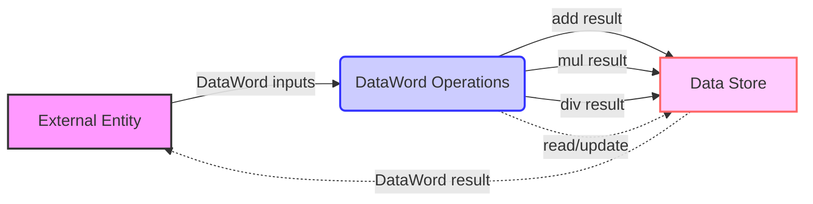

## Module: DataWord.java
 模块名称:DataWord

主要目的:表示256位数字,支持各种运算和转换

关键函数:
- value() 获取BigInteger值
- intValue() 转换为int
- longValue() 转换为long
- sValue() 获取有符号BigInteger值 
- isZero() 判断是否为0
- add() 加法
- mul() 乘法 
- div() 除法
- sub() 减法
- exp() 指数
- mod() 取模
- shiftLeft() 左移位
- shiftRight() 右移位

关键变量:
- data 存储字节数组
- MAX_VALUE 最大值
- ZERO 零值

与其他组件交互:
无明显交互

主要操作:
- 数值存储和表示
- 各种数值运算
- 位运算
- 数值转换

辅助操作: 
无

操作流程:
无明显流程

性能考量:
使用了一些大整数快速运算优化

重用性:
提供了通用的数字运算和转换功能,可广泛复用

使用方式:
可用来表示账户余额,交易金额等数字信息

假设:
无特殊假设
## Flow Diagram [via mermaid]

