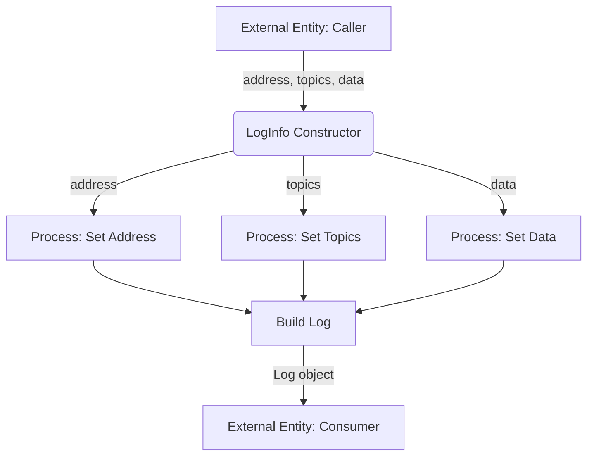

## Module: LogInfo.java
根据提供的代码模块，以下是用中文进行的综合分析：

- **模块名称**：LogInfo.java

- **主要目标**：该模块的目的是提供一个用于处理和存储区块链日志信息的结构，特别是在以太坊兼容的区块链（如Tron）中。这些日志信息通常与智能合约的事件和执行结果有关。

- **关键功能**：
  - 构造函数：初始化日志信息实例，包括地址、主题列表和数据。
  - `buildLog`：将`LogInfo`实例转换为`Protocol.TransactionInfo.Log`格式，以便与Tron区块链交互。
  - 获取方法：`getAddress`、`getTopics`、`getHexTopics`、`getClonedTopics`、`getHexData`、`getData`等方法用于访问日志信息的不同部分。

- **关键变量**：
  - `address`：日志所属的地址（通常是智能合约的地址）。
  - `topics`：与日志相关的主题列表，通常用于过滤和识别特定事件。
  - `data`：与日志相关的数据。

- **相互依赖性**：该模块依赖于`org.tron.protos.Protocol`（用于Tron的协议消息格式）、`com.google.protobuf.ByteString`（用于数据处理）和`org.bouncycastle.util.encoders.Hex`（用于数据编码）等外部库。

- **核心与辅助操作**：
  - 核心操作包括日志信息的创建和转换。
  - 辅助操作包括对日志信息的各种访问和处理方法，如获取十六进制格式的数据或克隆主题列表。

- **操作顺序**：首先通过构造函数初始化日志信息，然后可以通过提供的方法访问或转换日志信息。

- **性能方面**：性能考虑包括有效管理内存（例如，通过克隆数据来避免不必要的引用）和优化数据转换过程。

- **可重用性**：该模块设计为可重用，可以在处理不同区块链日志信息时复用，尤其是在需要与Tron区块链交互的上下文中。

- **使用**：在需要创建、处理和转换与智能合约事件相关的日志信息时使用该模块，特别是在开发与Tron兼容的区块链应用时。

- **假设**：
  - 假设提供的地址、主题和数据在创建时是有效的。
  - 假设使用者熟悉Tron区块链和智能合约的基本概念。

这个分析提供了对`LogInfo.java`模块的深入理解，包括它的设计目的、主要功能和使用场景。
## Flow Diagram [via mermaid]

