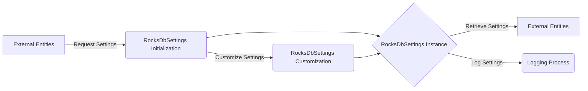

## Module: RocksDbSettings.java
- **模块名称**: RocksDbSettings.java

- **主要目标**: 此模块的目的是提供一个配置RocksDB数据库设置的框架，允许用户自定义数据库的各种参数，以优化性能和资源使用。

- **关键函数**:
  - `getDefaultSettings()`: 获取默认的RocksDB设置。
  - `getSettings()`: 返回当前的RocksDbSettings实例，如果不存在则返回默认设置。
  - `initCustomSettings(...)`: 允许用户自定义设置并初始化RocksDbSettings实例。
  - `loggingSettings()`: 打印当前RocksDB设置的日志信息。
  - 各种`with...()`方法: 提供了一种链式调用的方式来设置不同的配置项。

- **关键变量**:
  - `rocksDbSettings`: 静态实例，存储当前的RocksDbSettings。
  - `levelNumber`, `maxOpenFiles`, `compactThreads`, `blockSize`, `maxBytesForLevelBase`, `maxBytesForLevelMultiplier`, `level0FileNumCompactionTrigger`, `targetFileSizeBase`, `targetFileSizeMultiplier`, `enableStatistics`: 这些变量存储了RocksDB的各种配置参数。

- **相互依赖**:
  - 此模块依赖于RocksDB库来加载和设置数据库的底层参数。
  - 使用了`LRUCache`来缓存数据，以提高访问速度和效率。

- **核心与辅助操作**:
  - 核心操作包括初始化设置(`initCustomSettings`)和获取当前设置(`getSettings`)。
  - 辅助操作包括设置各种参数的`with...()`方法和打印设置日志(`loggingSettings`)。

- **操作顺序**:
  - 通常首先通过`initCustomSettings`自定义设置，然后在需要时通过`getSettings`获取当前设置。`loggingSettings`可用于调试和记录当前配置。

- **性能方面**:
  - 通过合理配置如`maxOpenFiles`, `compactThreads`, `blockSize`等参数，可以显著影响RocksDB的性能和资源利用率。

- **可重用性**:
  - 此模块设计为可重用，允许在不同项目中以不同的配置初始化和使用RocksDB。

- **使用**:
  - 在需要使用RocksDB作为数据存储解决方案的Java项目中，可以通过此模块来配置和优化数据库性能。

- **假设**:
  - 假设用户有基本的RocksDB知识，能够根据项目需求合理配置数据库参数。
  - 假设在模块使用前，RocksDB的库已正确加载。
## Flow Diagram [via mermaid]

