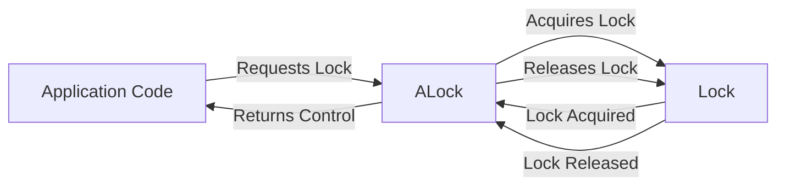

## Module: ALock.java
### 模块名称
ALock.java

### 主要目标
该模块的主要目的是提供一个自动关闭的锁包装器，以简化在Java中使用锁的过程，特别是在使用try-with-resources语句时确保锁的安全释放。

### 关键功能
- **构造函数(ALock)**: 接收一个`Lock`对象并初始化ALock实例。
- **lock()**: 加锁操作。调用内部`Lock`实例的`lock()`方法，并返回ALock实例本身，以便支持链式操作。
- **close()**: 解锁操作。作为`AutoCloseable`接口的一部分实现，当try-with-resources语句结束时自动调用，调用内部`Lock`实例的`unlock()`方法。

### 关键变量
- **lock**: `Lock`类型的变量，存储传递给ALock实例的锁对象。

### 依赖关系
ALock模块依赖于Java的`java.util.concurrent.locks.Lock`接口，用于执行加锁和解锁操作。

### 核心与辅助操作
- **核心操作**: 加锁(`lock()`)和解锁(`close()`)是此模块的核心操作，因为它们直接涉及到锁的管理。
- **辅助操作**: 构造函数是辅助操作，用于初始化ALock对象。

### 操作顺序
在典型的使用场景中，操作顺序如下：
1. 创建ALock实例，传递一个Lock对象。
2. 使用try-with-resources语句调用`lock()`方法加锁。
3. 在try块内执行需要同步的操作。
4. try块结束后，自动调用`close()`方法解锁。

### 性能方面
ALock模块的性能主要依赖于内部使用的`Lock`实现。使用`AutoCloseable`特性确保锁的及时释放，有助于避免死锁和提高应用性能。

### 可重用性
ALock设计为一个通用的锁包装器，可以与任何实现了`Lock`接口的锁对象一起使用，提高了代码的可重用性。

### 使用方式
```java
try (ALock l = new ALock(someLock).lock()) {
  // 在此处执行需要在锁保护下进行的操作
}
```

### 假设
- 假设使用者了解Java中锁的基本概念以及try-with-resources语句的使用。
- 假设内部使用的`Lock`实现是线程安全的。

通过提供一个简洁的接口来管理锁的获取和释放，ALock模块简化了并发编程中锁的使用，使代码更加清晰和安全。
## Flow Diagram [via mermaid]

