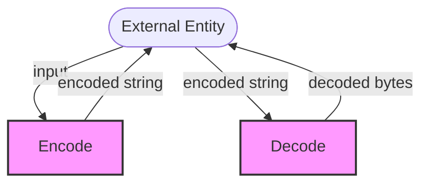

## Module: Base58.java
- **模块名称**：Base58.java

- **主要目标**：该模块的目的是提供一种机制，用于将字节数据编码和解码为Base58格式。Base58编码常用于加密货币领域，特别是比特币，用于生成可读的地址。

- **关键函数**：
  - `encode(byte[] input)`：将字节数据编码为Base58格式的字符串。
  - `decode(String input)`：将Base58格式的字符串解码回原始字节数据。
  - `divmod58(byte[] number, int startAt)`：用于编码过程中的数字转换。
  - `divmod256(byte[] number58, int startAt)`：用于解码过程中的数字转换。
  - `copyOfRange(byte[] source, int from, int to)`：辅助方法，用于数组复制。

- **关键变量**：
  - `ALPHABET`：Base58编码所使用的字符集。
  - `INDEXES`：字符到索引的映射，用于加速解码过程。

- **交互依赖**：该模块主要独立工作，但它的使用可能依赖于需要Base58编码/解码的其他系统组件，如加密货币地址的生成和验证。

- **核心与辅助操作**：
  - 核心操作包括`encode`和`decode`方法，它们直接关联到Base58编码和解码的主要功能。
  - 辅助操作包括`divmod58`、`divmod256`和`copyOfRange`，这些方法支持核心操作。

- **操作序列**：编码操作首先计算输入中的前导零，然后进行Base58转换。解码操作首先将Base58字符串转换为字节序列，然后进行相反的转换。

- **性能方面**：性能考虑包括处理前导零的效率，以及编码和解码过程中的数学运算效率。数组操作（如复制和转换）也影响总体性能。

- **可重用性**：该模块设计为通用的Base58编码和解码工具，可在需要Base58处理的任何Java项目中重用。

- **使用**：在加密货币（特别是比特币）项目中，用于生成和解析可读的地址。也可用于任何需要Base58编码数据的场景。

- **假设**：假设输入字符串仅包含有效的Base58字符，并且输入字节数据在编码前有效处理（如，考虑前导零）。此外，假设系统支持US-ASCII编码。
## Flow Diagram [via mermaid]

