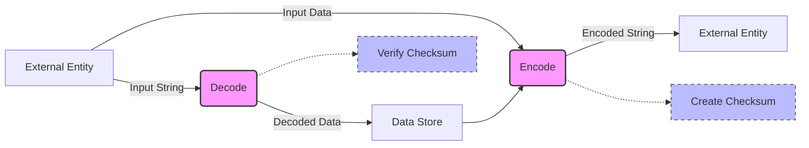

## Module: Bech32.java
- **模块名称**：Bech32.java

- **主要目标**：该模块的目的是实现Bech32编码和解码。Bech32是一种编码方法，主要用于比特币和其他加密货币的地址格式。

- **关键函数**：
  - `encode(final Bech32Data bech32)`和`encode(String hrp, final byte[] values)`：用于将数据编码成Bech32格式的字符串。
  - `decode(final String str)`：用于将Bech32格式的字符串解码回原始数据。
  - `createChecksum(final String hrp, final byte[] values)`：生成校验和。
  - `verifyChecksum(final String hrp, final byte[] values)`：验证校验和是否正确。
  - `expandHrp(final String hrp)`：扩展人类可读部分（HRP）以用于校验和计算。

- **关键变量**：
  - `CHARSET`：用于编码的字符集。
  - `CHARSET_REV`：用于解码的字符集。

- **互相依赖**：该模块主要独立，但它处理的数据格式和校验逻辑可能与系统中用于地址验证和生成的其他组件有交互。

- **核心与辅助操作**：
  - 核心操作：编码和解码功能是该模块的核心，因为它们直接关系到Bech32格式的生成和解读。
  - 辅助操作：校验和的创建和验证支持编解码过程，但可以视为辅助性质。

- **操作序列**：在编码过程中，首先扩展HRP，然后计算数据的校验和，最后将HRP、数据和校验和组合成最终的Bech32字符串。在解码过程中，验证校验和的正确性是首要步骤。

- **性能方面**：性能考虑主要集中在有效地处理编码和解码操作，尤其是在校验和计算上。

- **可重用性**：由于Bech32编码是比特币和许多其他加密货币通用的地址格式，该模块具有很高的可重用性，可以轻松集成到需要此类编码功能的任何系统中。

- **使用**：主要用于加密货币钱包、交易所和其他金融应用中，用于生成和验证地址。

- **假设**：
  - 输入字符串符合Bech32规范。
  - 人类可读部分（HRP）和数据部分的长度在合理范围内。
  - 使用者了解Bech32格式的基本要求和限制。
## Flow Diagram [via mermaid]

